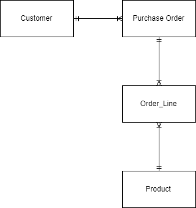
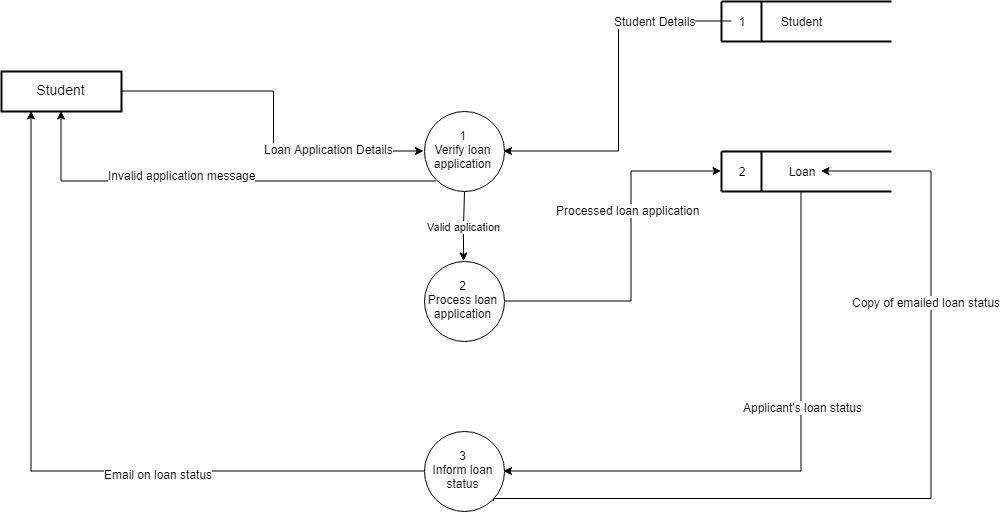
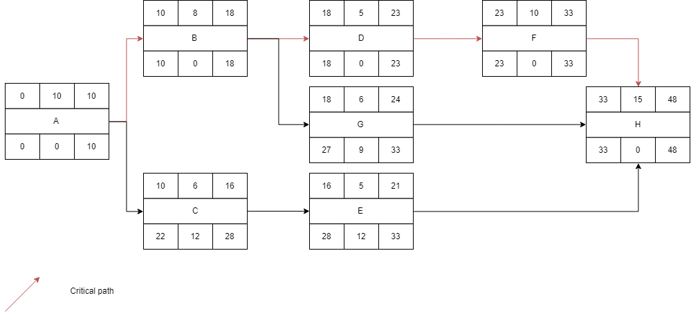

# ADIS PYQ 0916

## Q1

### Part A

- Request from top management
  - The owner of Inanam Motor request Mr. Christopher  for a new inventory control system to replace current system.
- Existing system
  - The previous system is unable to show accurate inventory level and requires a lot of manual input. Therefore, a new, more efficient system is requested to replace the existing system.

### Part B

#### Tangible Benefits

- Reduced cost
  - By implementing the new inventory control system, inventory management can be handled with less staff, therefore, cost of operation is reduced.
- Reduced errors
  - By implementing the new inventory control system, inventory level can be accurately tracked, and can be refilled according to needs. This reduces the time wasted on keeping track on the actual inventory level.

#### Intangible Benefits

- Improved staff morale
  - Inventory management staff no longer have to repeatedly calculate inventory due to inefficiencies within old system, decreasing manual workload and making their job less mundane and tedious, hence improving their morale.
- Greater reliability
  - The planned system is more reliable to keep track of inventory compared to the current system, as automation  and constraints of input is made to ensure the reliability of the data entered.

### Part C

- Improved performance
  - Inanam Motor Tire Ltd. requires a new system that is able to keep up with the growing business, therefore, the system should be faster and more comprehensive than the current one.
- Quality Information
  - Inanam Motor Tire Ltd. is having issues to keep track of inventory levels accurately. The new system is expected to provide dependable, high quality information regarding the inventory levels at all times to make inventory management more efficient.

### Part D

- Questionnaire
  - Large population
    - Because Inanam Motor Tire Ltd. is a large company, there are also a large number of staff. Questionnaire allows for fact gathering from the users of the system efficiently in terms of time.
  - Factual information
    - Many of the actual improvements, and suggestions requests require thinking and elaboration after thinking. Therefore, more useful information can be obtained from the users if they are given time to think and elaborate on factual information.

## Question 2

### Part A

1. Sequence code is a type of code where numbers of letter in a specific order is used.
   1. One example is : 0001 for the first invoice and 0002 for the second invoice.
2. Block sequence code is a type of code utilizing blocks of different number for classification
   1. One example is in a train ID code, where a number such as '410' can have the first digit representing the number of couches, and the second and third number representing the ID number of the train.

### Part B

#### Q1

Direct changeover refers to finding a suitable time, completely stopping the old system and replacing it with a new system.

#### Q2

Parallel run refers to running the old and new system side by side to compare outputs. Once the new system is prove satisfactory, the old system is phased out and replaced with the new system.

#### Q3

Pilot run refers to the setting up of a 'pilot branch' to test the new system before rolling out to the rest of the 'branches'.

### Part C

## Q3

### Part A

- **Expandability**: The code should have room for further growth
- **Stability**: Do not require frequent updating

### Part B (SIMPLIFIED decision table)

#### Conditions

- Order less than or equal to RM1000?
- Order from East Malaysia?
- Order from West Malaysia?

#### Actions

- Charge RM25 delivery
- Charge RM10 delivery
- Charge RM50 delivery
- No delivery charge

| Conditions                          | 1    | 3    | 4    | 5    |
| ----------------------------------- | ---- | ---- | ---- | ---- |
| Order less than or equal to RM1000? | Y    | Y    | Y    | N    |
| Order from East Malaysia?           | Y    | N    | N    | \~   |
| Order from West Malaysia?           | ~    | Y    | N    | \~   |
| Charge RM25 delivery                | X    |      |      |      |
| Charge RM10 delivery                |      | X    |      |      |
| Charge RM50 delivery                |      |      | X    |      |
| No delivery charge                  |      |      |      | X    |

### Part C (DFD 0)

**System:** Loan Application System

**Processes:** Accept loan application details, Verify loan application, Process loan application, Inform loan status

**Entities:** Student

**Data store:** Student, Loan

## Question 4

### Part A

#### Part I

#### Part II

A, B, D, F, H

#### Part III

48 days

#### Part IV

The overall duration of the project will be increased by 3 days. This is because activity B has a slack time of 0 days, which is less than 3 days, and cannot be delayed without affecting the overall duration of project.

#### Part V

- #### Allocate resources

  - Allow project manager to allocate the most experienced team members to the critical activities.

### Part B

#### Part I: Corrective Maintenance

- Maintenance done to fix unforeseen flaws or bugs during the operation of the system
- Examples: Fix system security flaw, Repair defective cable

#### Part II: Adaptive Maintenance

- Maintenance done to adapt/scale the system to meet the changing environment.
- Examples: Changes in employment law, hardware upgrade due to performance limitation.

