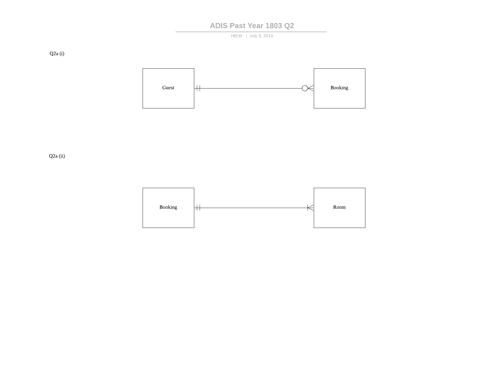
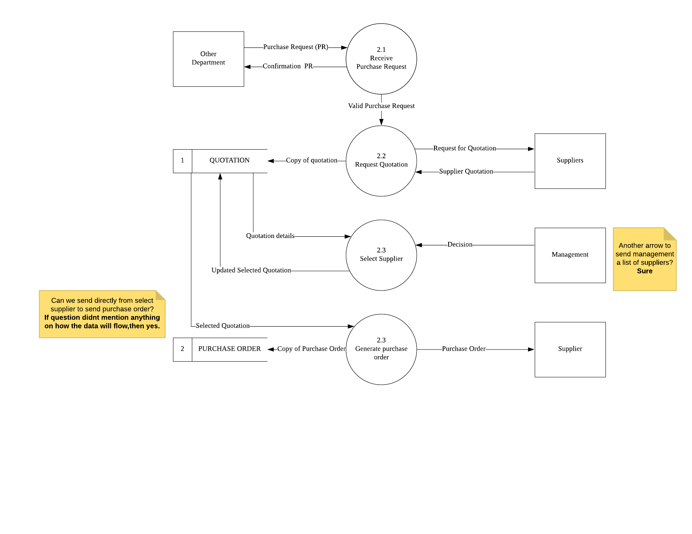
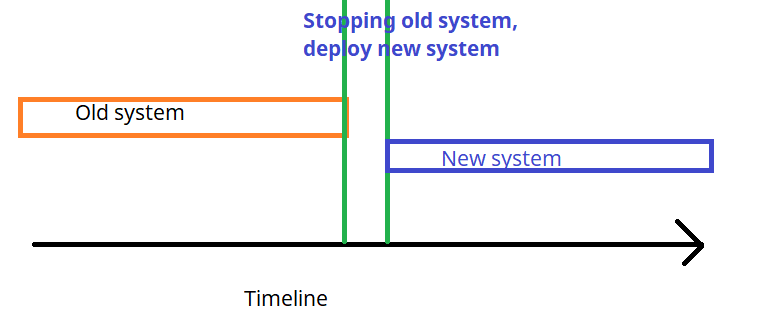
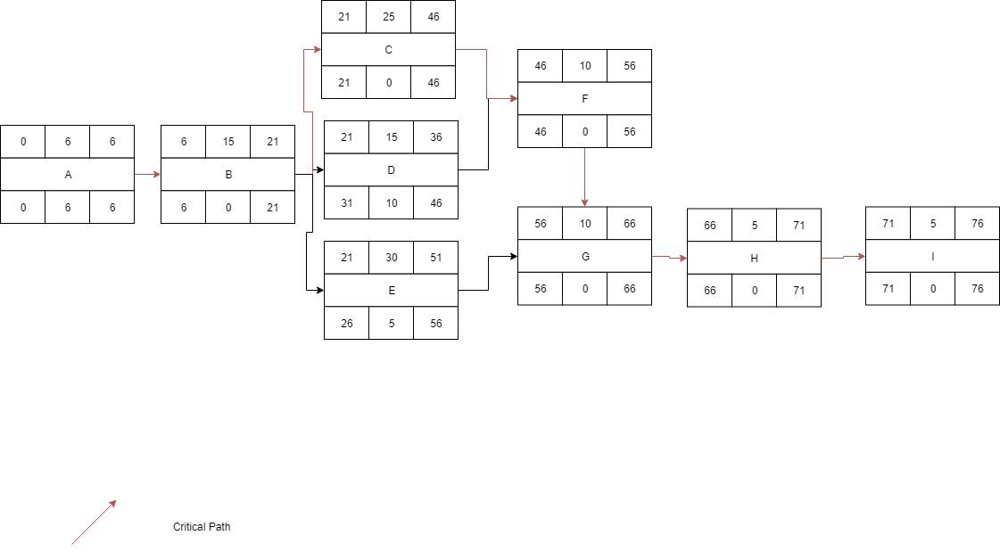

# ADIS2183 QP 201803

## Question 1

### a) Define the term system request

System request is a formal request of the services from the IS department.

### b) Based on the above case study, identify and explain TWO (2) sources of system request

The first source of system request is **directives from top management**. Mr. Sam is the owner of the business, he passes down a directive to Mr. Patrick to perform a preliminary investigation.

Another source of system request is **existing system**. The old system is still currently relying a lot of users input, as is insufficient to handle users needs. The new system is expected to solve the problem faced.

### c) Explain preliminary investigation from the aspect of the purpose and expected outcome of conducting a preliminary investigation

Preliminary investigation is needed to gather information to **determine if problems** specified **in the system request warrant conducting subsequent phases of the SDLC**. 

The expected outcome is a **preliminary investigation report** to the management for recommendation.

### d) Suggest ONE (1) suitable fact gathering technique that can be used by Mr. Patrick to gather business requirements from the owner of a car service center. Justify your answers with TWO (2) reasons

**Interview**. (follow lecture notes)

1. **Able to clarify facts.** Mr. Patrick is able to ask follow-up questions to Mr. Sam to clarify on factual questions that are not properly answered. 
2. **Able to see body language.** While asking questions on functionality, Mr. Patrick is able to observe Mr. Sam's body language to understand which functionality and problems are more important to Mr. Sam implicitly.

### e) Discuss THREE (3) non-functional requirements for the proposed office systems

**Storage requirements**. The three systems implemented must be able to quickly retrieve previous information, process entered information and update them quickly to ensure the office can operates smoothly with minimal time wasted.

**User interface requirements.** The three systems implemented should be easy for Mr. Sam's staff to use, and also help to speed up their work by allowing automatic data entry.

**Reliability requirements.** The system must be able to process office tasks, and continue to do so without failure over long periods of time to ensure Mr. Sam's customers can be served well.

Extra:

1. User friendliness
2. Security

## Question 2

### a) Draw entity relationship diagram for each of the following scenarios

#### i) A GUEST may place zero or many BOOKING. Each BOOKING must be placed by one and only one GUEST

#### ii) A BOOKING may include one or more ROOM. Each ROOM must belong to one and only one BOOKING

### b) Draw a DFD 1

## Question 3

### Part A

1. **Corrective maintenance.** Fix unforeseen faults arising during operation, in this case, involves repairing faults.
2. **Adaptive maintenance.** Adapt the system to meet changing environment, in this case, improvement in system to improve performance without changing user interface.

### Part B

1. Direct changeover requires stopping of the old system during a suitable time and completely replacing it with the new system.

2. Parallel changeover involves the running of the old system and new system together over a certain period of time. Once the new system is proven to be satisfactory, the old system is phased out and replaced with the new system.

## Part C

Conditions:

- Have bank account?
- Have no outstanding loan?
- Management approval obtained?

Actions:

- Approve loan application
- Reject loan application

| Conditions:                   | 1    | 2    | 3    | 4    | 5    | 6    | 7    | 8    |
| ----------------------------- | ---- | ---- | ---- | ---- | ---- | ---- | ---- | ---- |
| Have bank account?            | Y    | Y    | Y    | Y    | N    | N    | N    | N    |
| Have no outstanding loan?     | Y    | Y    | N    | N    | Y    | Y    | N    | N    |
| Management approval obtained? | Y    | N    | Y    | N    | Y    | N    | Y    | N    |
| **Actions**                   |      |      |      |      |      |      |      |      |
| Approve loan application      | X    | X    | X    |      |      |      |      |      |
| Reject loan application       |      |      |      | X    | X    | X    | X    | X    |

## Question 4

### Part A

| Criteria    | Integration Test                                             | User Acceptance Test                                         |
| ----------- | ------------------------------------------------------------ | ------------------------------------------------------------ |
| Meaning     | Test the functionality of the system as a whole              | Testing done by end-users to evaluate system                 |
| Purpose     | Ensure all functions work and pass data to each other correctly | Ensure the program meets the user requirements defined in the user requirements specification |
| Test data   | Realistic data                                               | Real data                                                    |
| Who perform | Programmers                                                  | End-user                                                     |

### Part B

1. 
2. A, B, D, F, G, H, I
3. 76 days
4. Slack time refers to the time a certain activity can be delayed without causing delay to the project completion
5. The overall duration of the project will be delayed by 3 days. This is because activity B is an activity on the critical path, and has a slack time of 0, which is less than 3 days. Therefore, any delays on any activity in the critical path will delay the entire project.