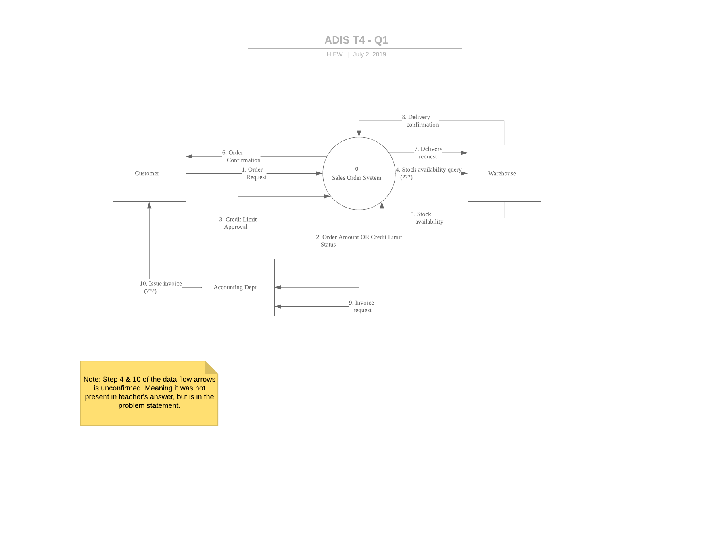
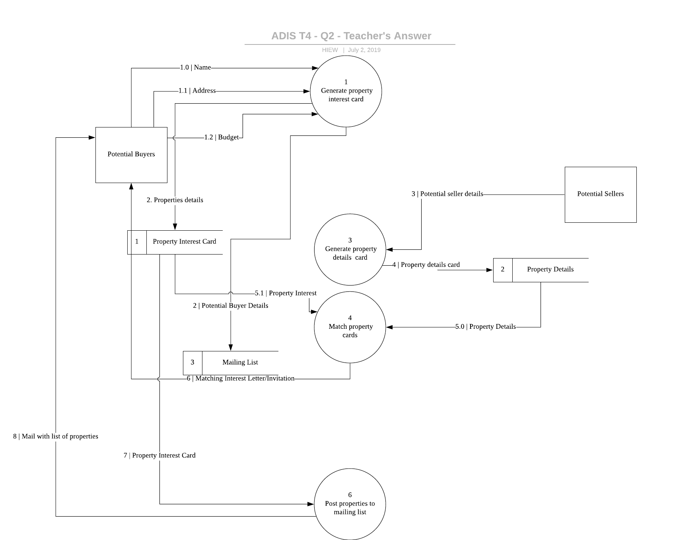
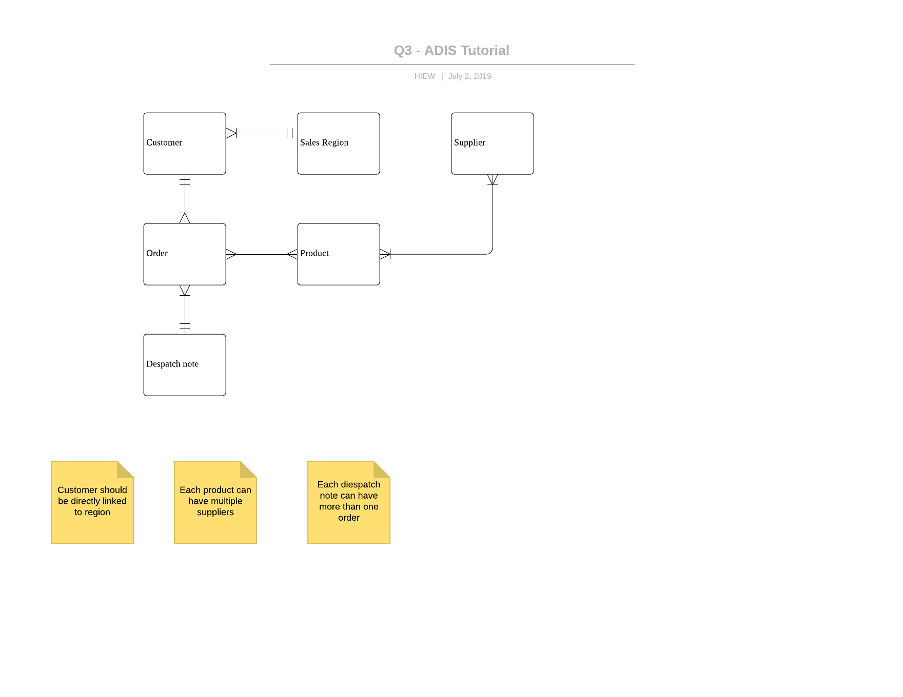
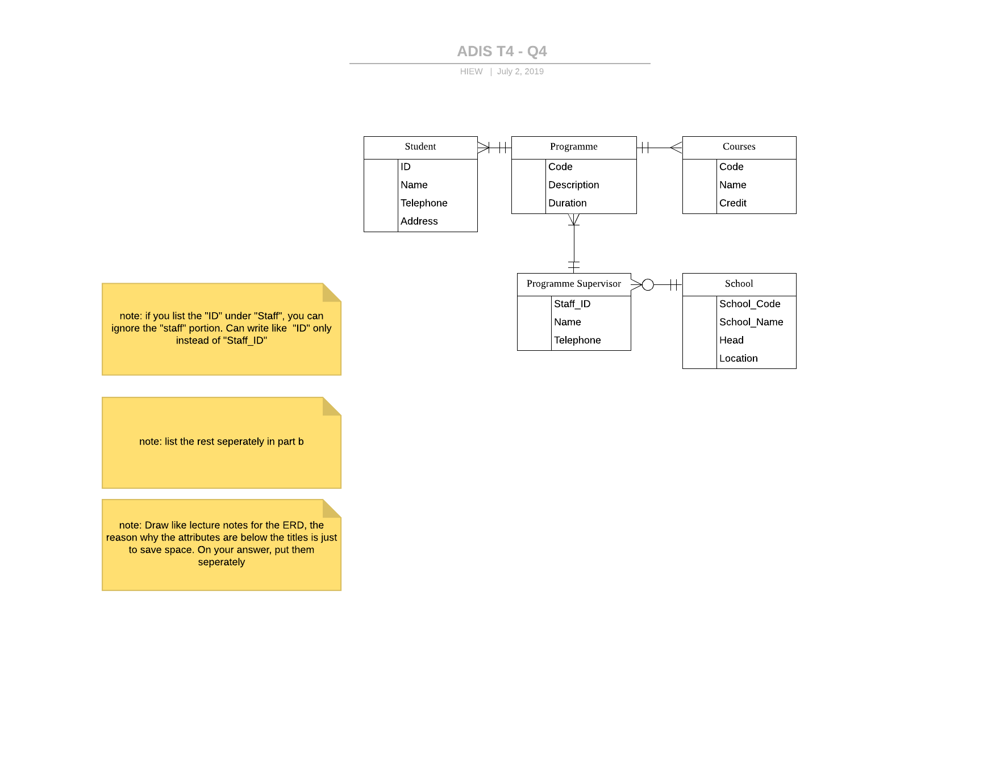

# Tutorial 4

## Editable Charts

https://www.lucidchart.com/invitations/accept/80741477-0bd3-4378-b87a-0dc729311e83

## Q1

In a Sales Order System, when a sales order is received from a customer, the sales personnel would have to check whether the particular customer’s credit limit has been exceeded or not. This can be carried out by checking with the Accounts Dept. The next thing to check is the availability of the stock items ordered with the Warehouse. When these are in order, an order confirmation will be sent to the customer and a delivery request will be sent to the Warehouse immediately. The Warehouse would confirm if the delivery of goods has been completed. After the goods have been sent to the customer, an invoice request will be sent to the Accounts Dept to issue an invoice to the customer. 

Draw a Context Diagram of the above.

## Q2

The following describes the business process of an estate agent. When potential buyers phone in for information about properties available, a Property Interest card will be completed. The potential buyer’s details (eg. name, address) will be recorded. At the same time, a mailing list will be created and stored for future use, example sending out monthly magazine and news on properties. Potential sellers of properties will also have their details recorded onto a Property Details card. This gives the name and address of the seller and the details of the property or land they wish to sell. On a weekly basis, the buyers’ interests and the sellers’ interest will be matched. This can be carried out by matching the Property Interest cards details with the details on the Property Details cards. When there is a good match, letters will be sent to the potential buyers with details of the relevant properties. In order to generate interest, on a monthly basis (last day of a month), a list of properties (from the Property Details cards) will be created and posted to potential buyers on the mailing list.

### How I draw

1. Start with the first sentence, and follow on until the last sentence.
2. Place all the processes on the center of the graph, allowing me to see things clearly.
3. Place all the entities with their related data stores on one side, and the same for the other sides. The reason is to minimize crosssing.
4. Join the entities, processes, and data stores by following line-by-line of the scenario. Did it sentence by sentence (you can refer to the numbering of the data flow).

## Q3

The entity-relationship diagram (ERD) shown below has been drawn for an order processing system.

The diagram is based on the following interview notes.

Interview Notes

- A customer may place many orders but must have placed at least one order. Each order will come from only one customer.
- A particular product may be listed on different orders. An order will usually contain many products.
- Each product can be purchased from a number of suppliers. Some suppliers supply more than one product. A supplier must supply at least one product.
- An order is always dispatched in a single delivery. However, sometimes more than one order is listed on the same despatch note.
- Each customer is allocated to a sales region. A sales region may have more than one customer in it. A sales region must have at least one customer in it.

## Q4

The following information has been recorded in an interview. 

1. At a college, each student is identified by a unique student number. The college also stores each student id, student’s name, telephone and address. 
2. Each student must register on only one programme. Each programme is uniquely identified by a programme code and it also has a description and a duration (in number of hours studied). A programme has a minimum of one student.
3. Each programme contains a number of courses. Each course can be identified by a unique course code and has a course name and credit. 
4. Each programme must be managed by a programme supervisor. The following information is stored about each programme supervisor – staff id, name and telephone number. A programme supervisor may manage many programmes but must manage at least one. 
5. Each programme supervisor must be allocated to a school. The following information is held about each school – school code, school name, head of school and location. Some schools employ many programme supervisors, while others do not employ any at all. 

Required: 

(a) Using a standard notation, draw an entity-relationship diagram (ERD) for the above information. 

(b) Identify and list the attributes of each entity above.

(Combined answer: Remember to split them, and for (a) draw lik lecture notes instead)

