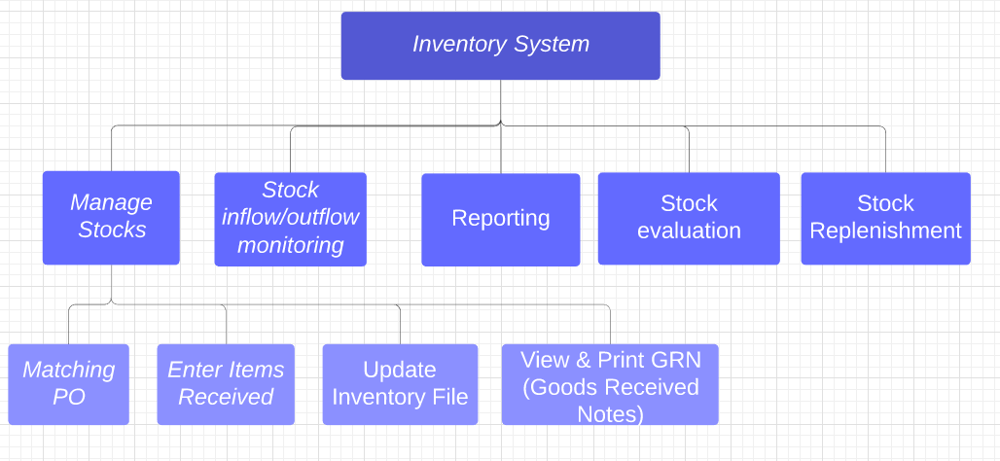
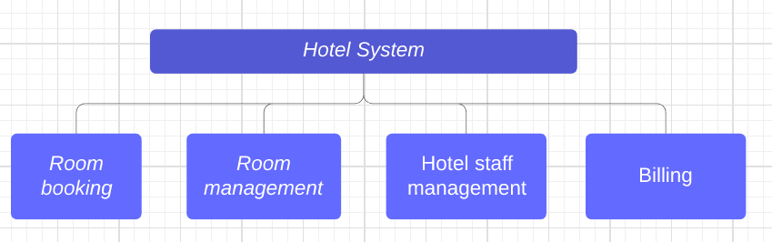
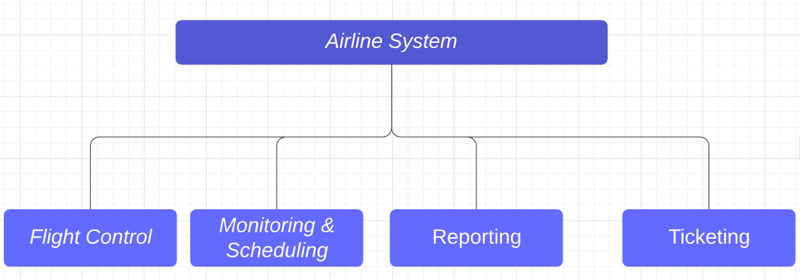

# Tutorial 5: System and Interface Design

## Q1

Draw a functional decomposition diagram for each of the following information systems to show major business functions (or modules) provided by the system and break down each of the functions into sub-functions or sub-modules.

- **Inventory System**
- **Library System**
- **Hotel System**
- **Airline System**

Note, all the modules must relate back to the library parts. Don't go too general.

Example: Budgeting & Security is a little too general for Library. But Membership management and reporting is okay.

### Inventory System

### Library System

### Hotel System

### Airline System

## Q2

An analyst has already completed analysis of the users’ requirements. He is now in the system design stage. The system involved is an inventory system (raw material) for a manufacturing firm. The analyst has been assigned the responsibility of designing suitable reports that could be useful for staff at all levels of the organization. The users may also include those from other departments where their systems are linked and interfaced with the inventory system.

**Required:**

Identify 4 reports (with titles) which in your opinion will be useful to the users. For each report listed, briefly describe what the report would contain and to whom it would be useful and for what purpose.

> 1. **Restocking report**
>
>    1. **Contain:** The name, quantity, price, and date of stocks being moved inside the warehouse.
>    2. **Whom it will be useful:** Retailers
>    3. **Purpose:** To allow retailers to know available new stocks, and order them
>
> 2. **Low Stock report**
>
>    1. **Contain:** The name, and price of products which are currently out of stock and require replenishment
>    2. **Whom:** Suppliers
>    3. **Purpose:** To identify the products in need of restocking and to deliver the required stocks
>
> 3. **Inventory On Hand report**
>
>    1. **Contain:** The name, quantity, price, of all the stocks currently available
>    2. **Whom it will be useful:** Retailer
>    3. **Purpose:** To know what are the stocks available to be sold.
>
> 4. **Product Performance Report**
>
>    1. **Contain:** The name, quantity, price, and the quantity sold in a specific time interval
>    2. **Whom it will be useful:** Purchasing manager
>    3. **Purpose:** Identify products having good track record to know which products to stock up and sell.
>
> 5 (EXTRA). **Stock-in report**
> 	- Storekeeper, store manager
> 	- To keep track of the stocks that have been received in time, and any that is still outstanding.
> 	
>
> 6 (EXTRA). **Stock category report**
> 	- storekeeper, stock manager
> 	- to allow for easier searching by the stock staff.

## Question 3

EXTRA NOTES: 

- **Validation**: Check by system

- **Verification**: Check by human

*Determine the type of data validation check based on the examples given below.*

(i) Check that the daily hours worked by an employee, for example, must fall within the range of 0 to 24.

- > *Range check*

(ii) Check that a numeric field must have only numbers or numeric symbols, and an alphabetic field can contain only the characters A through Z or a through z

- > *Data Type check*

(iii) Verify that a customer number on an order matches a customer number in the customer file.

- > *Existence check*

(iv) Check that the suitable values are entered in the required fields, and not left empty, or else the record would not be accepted or saved.

- > *Null value check*

(v) Check that transactions must be entered chronologically. A transaction with an out-of-sequence data indicates an error.

- > *Sequence check*

(vi) Input payment values of $0.05 and $5,000,000.00 both pass a simple limit check for a payment value greater than zero, but the value of $5,000,001.00 is not able pass the $5,000,000.00 upper limit check.

- > *Limit check*

(vii) Check that the order input has an input discount rate applicable only for the determined purchased units.

- > *Limit check*

(viii) Check that the system totals do match the input totals, or else data entry error has occurred.

- > *Batch total check* (Yea I get it, we don't even learn this, its a wonder why they ask this)

## Question 4

Many systems have designs that require users to enter data manually. In doing so, users frequently
make a lot of mistakes and also take time to complete their job.

With regard to system design, suggest FOUR (4) design areas which a system designer can include in
order to reduce the amount of data input manually.

- **Drop-down list**: A list of enterable values, to both minimize errors and to automate long input.
- Data validation
- **Default value**: Values entered automatically to handle majority of the input cases
- Checkbox/Radio Button

EXTRA

- **Input completion:** Automatically help to complete input by predicting possible user inputs.
- **Automatic error-correction:** Automatically helps user to correct small errors, without causing users potential problems.

## Question 5

A library system consists of many sub-systems. One sub-system involves checking out books which the students want to borrow at the counter. With reference to the above case, explain to an analyst the potential consequences of a poor user interface.

- **Data integrity failure** 
- **System unresponsive**
- **Slow performance**

Those answer above are given by the teachers, these answers below are found online. Personally, I find them easier to understand, but your mileage might vary (YMMV):

- Need more time to perform task
- Cause librarians to make more errors
- Make librarians feel dissatisfied
- Need more time to learn
- Librarians have difficulty to use the full functionality of software
- (If given a choice) refrain from using the software

## Lucidchart Link (Editable Charts)

 https://www.lucidchart.com/invitations/accept/870c9e70-db3a-4015-a492-36fc7fd67d80