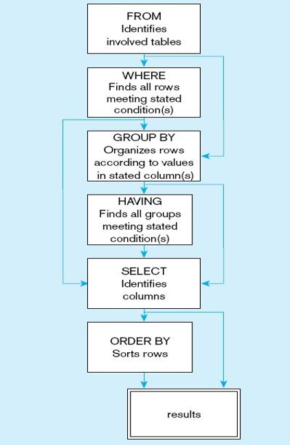

# Lecture 3: SQL - Part 1, Basic SQL Manipulation


## Custom notation

1. {something} refers to custom input

2. SQL fits into two broad categories:
   1. Data definition language 
      1. Include commands to create database objects & define access rights
   2. Data manipulation language
      1. commands to insert, update, delete, and retrieve data within database

## Intro to SQL

1. SQL statement: reserved words + user-defined words
   1. reserved words: fixed meaning, 'character-sensitive'
2. Most SQL statements are case insensitive but 'character-sensitive', literal character data must be exact.
3. Use `;`, statement terminator to mark end of SQL statement


## Common SQL data manipulation commands

1. `SELECT`
2. `ORDER BY`
3. Mathematical operators
4. Logical operators
5. Special operators
6. Aggregate functions
7. `INSERT`, `UPDATE`, `COMMIT`, `ROLLBACK`

## Defining a column alias

1. Immediately follow the column name
2. Can be used with `AS` keyword
3. Double quotation: enables the user of space and case-sensitive works
4. In SQL*PLUS, using a column aliases without quotations will display all the titles as full capital letters.

## Duplicate rows

Use `DISTINCT` to exclude duplicate rows

`SELECT DISTINCT department_id FROM employees;`

Duplicate means EXACT duplicate, if even a single place is non-duplicate (like say you have more than one column and it differs), it is displayed

## Restricting and sorting data

### SQL SELECT statement

Syntax:

```sql
SELECT  *|{[DISTINCT] column|expression [alias],...}
FROM    table
[WHERE  condition(s)]
[ORDER BY {column, expr, alias} [ASC|DESC]] ;
```

Oh, remember the `;`, semi-colon at the end.

- Limit rows with:
  - `WHERE` clause
  - Comparison & Logical conditions
- NOTE: Rules of precedence
- Sort rows using the `ORDER BY` clause

- Enclose character strings & dates with single-quotes
- Character is case-sensitive and date values are format-sensitive
- Default date format `DD-MON-YY` in SQL*PLUS (damn why not DD-MM-YY?!)


## Range condition with `BETWEEN`

- Used with `WHERE`
  - Example: `WHERE` salary `BETWEEN` xxx `AND` xxx

## Membership Condition Using the `IN` Operator

- Test for values in a list
  - Eg: `WHERE` manager_id `IN` (100, 101, 201);

## Pattern Matching Using the `LIKE` operator

- Perform wildcard searches of valid string values, conditions can be:

- characters/numbers (case-sensitive)
- Wildcards
  - `%` denotes 0 or more character
  - `_` denotes 1 character
- they can be combined

## Using NULL Condition

`WHERE manager id IS NULL;`

## Logical Operators

1. `AND`
2. `OR`
3. `NOT`
4. Returns `true` if true according to the requirements

## Rules of precedence

1. Arithmetic
2. Concatenation
3. Comparison
4. Negation, Null
5. Betweens
6. Not equal
7. Logical conditions

## `ORDER BY` clause

### Example usage:

```sql
SELECT {key}
FROM   {table}
ORDER BY first_name DESC;
```

- sorting sequence:
  - `ASC` = ascending (default if not specified)
  - `DESC` = descending

- sorting way (pair with sorting sequence, default is `ASC`):
  - `{field_name}` = sort by the field name
  - `{alias}`  = sort by the column's alias
  - `{number}` = sort by the column's numeric position, wher `number` should be n integer.
    - Example: if say your table has `first_name` at position 1 and `last_name` at position 2, entering `ORDER BY 2;` will order it by `last_name`
- Comes last

## Displaying Data from Multiple Statements

### SELECT statement

- Used to query single or multiple tables.
- Clauses
  - `SELECT`: which column
  - `FROM`: which table
  - `WHERE`: condition is specified (for rows)
  - `GROUP BY`: what category
  - `HAVING`: condition specified (for groups)
  - `ORDER BY`: the order and/or the column

### Flow Chart of Processing Statement



### Going from Pseudocode to SQL Statements

1. Identify which table is required
   1. `FROM EMPLOYEES, DEPARTMENTS`
2. Specify your condition
   1. `WHERE EMPLOYEES.Department_ID = DEPARTMENT.department_ID`
3. Specify what to display
   1. `SELECT EMPLOYEES.employee_ID, EMPLOYEES.department_ID, DEPARTMENTS.department_name`
4. Combine them together, starting from `SELECT` to `FROM` and lastly, `WHERE`, then add a `;` to form an SQL statement

```sql
SELECT EMPLOYEES.employee_ID, EMPLOYEES.department_ID, DEPARTMENTS.department_name
FROM EMPLOYEES, DEPARTMENTS
WHERE EMPLOYEES.Department_ID = DEPARTMENT.department_ID
```

### Simplifying SQL statements

1. Use aliases to simplify SQL statement

Example:

```sql
FROM EMPLOYEES E, DEPARTMENTS D
```

then, replace every other occurences of `EMPLOYEES` with `E`, and `DEPARTMENTS` with `D`

### Query Answers

Query: Display employees job history from when he/she was first hired. Include relevant details.

```sql
SELECT E.employee_id, E.first_name, E.last_name, J.start_date 
FROM JOB_HISTORY J, EMPLOYEES E
WHERE J.employee_id = E.employee_id;
```

```sql
SELECT E.first_name, E.last_name, R.region_name
FROM EMPLOYEES E, REGIONS R,
     DEPARTMENTS D, LOCATIONS L,
     COUNTRIES C
WHERE E.department_id = D.department_id          AND D.location_id = L.location_id
      AND L.country_id = C.country_id
      AND C.region_id = R.region_id;
```

## Reporting Aggregated Data Using the Group Functions

Types of group functions:
- `AVG`
- `COUNT`
- `MAX`
- `MIN`
- `SUM`

Note: Functions are always *one-to-one* or *one-to-many*, no function can be *many-to-many*.

## `AVG` and `SUM` functions

- Numeric data
- Use for numeric data, the format is `group_function(column)`
- Example: `AVG(salary)`

## `MIN` and `MAX`

- Numeric, character, and date data 
- Example:

```sql
SELECT  MIN(hire_date), MAX(hire_date)
FROM    employees;
```

## `COUNT`

- return the number of row in a table
- note: only non-null values

```
SELECT  COUNT(*)
FROM    employees
```

## `DISTINCT`

- `COUNT(DISTINCT expr)` return number of *distinct* non-null values of expr.

## `NVL`

- Forces group functions to include null values
- Example: `SELECT AVG(NVL(commission_pct, 0)) FROM emloyees;

## `GROUP BY`

```sql
SELECT    column, group_function(column)
FROM      table
[WHERE    condition]
[GROUP BY group_by_expression]
[ORDER BY column];
```

- columns in `SELECT` that are not in group functions (eg. `AVG`) must be in `GROUP BY` clause
- columns in `GROUP