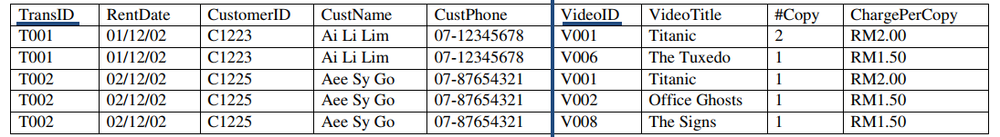
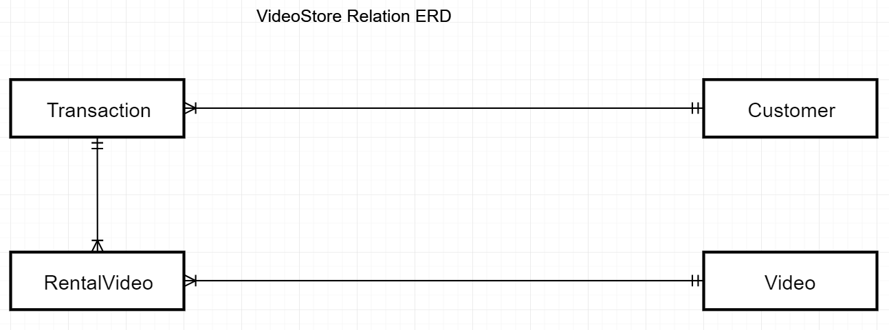
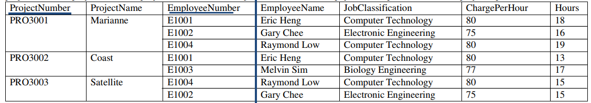

# Model Questions and Answers

## Notes (and Note to myself: remember to double-check answer with teacher)

Before going to the answers, its important to know that if the question ask for the explanation for the anomalies (which is :fire: topic in exams), such as the line below:

**Explain the three data anomalies** 

**Answers**

> **Insertion anomaly:** Inability to add new records without adding reduction data.
>
> **Modification/Updating anomaly:** Inability to accurately and efficiently and efficiency.
>
> **Deletion anomalies:** Inability to delete unwanted data without also deleting wanted data.

## Normalization Q&A

### 1. VideoStore Relation

1. Normalize the above structure to 1NF, 2NF and 3NF by providing meaningful relation names.

   > **0NF (Just for info)**
   >
   > **VideoStore**(<u>TransID</u>, RentDate, CustomerID, CustName, CustPhone, <u>VideoID</u>, VideoTitle, #Copy, ChargePerCopy)
   >
   > 
   >
   > **1NF** (Resolve repeating groups)
   > **Transaction**(<u>TransID</u>, RentDate, CustomerID, CustName, CustPhone)
   > **RentalVideo**(<u>VideoID</u>, VideoTitle, #Copy, ChargePerCopy, <u>TransID*</u>)
   >
   > 
   >
   > **2NF** (Resolve partial dependencies)
   >
   > **Transaction**(<u>TransID</u>, RentDate, CustomerID, CustName, CustPhone)
   > **RentalVideo**(<u>VideoID*</u>, #Copy, <u>TransID*</u>)
   > **Video**(<u>VideoID</u>, VideoTitle, ChargePerCopy)
   >
   > 
   >
   > **3NF** (Resolve transitive dependencies)
   >
   > **Transaction**(<u>TransID</u>, RentDate, CustomerID*)
   >
   > **Customer**(<u>CustomerID</u>, CustName, CustPhone)
   > **RentalVideo**(<u>VideoID*</u>, #Copy, <u>TransID*</u>)
   > **Video**(<u>VideoID</u>, VideoTitle, ChargePerCopy)
   >
   > **Extra note:** It is important to write the *(resolve...)* part, sometimes they will give 1 mark.

   

2. The table is susceptible to anomalies. Provide examples of insertion, deletion and modification anomalies.

   > 1. *INSERTION ANOMALIES*
   >    It is not possible at add a new video unless the new video is rented by customer.
   > 2. *MODIFICATION*
   >    When we update the video title (V001) from Titanic to GPS Signal Lost, we also need to update the similar item description in another row, if not it will cause data inconsistency.
   > 3. *DELETION*
   >    When we delete the Transaction (T002) we also will delete the VideoTitle: The Tuxedo (V006).
   >    OR 
   >    When we delete the Transaction (T002) we will also delete the Video

3. Based on 3NF, draw an E-R diagram (Crow’s Foot notation).
   

### 2. Project Relation

1. Normalize the above structure to 1NF, 2NF and 3NF by providing meaningful relation names. 

   > **0NF (Just for info)**
   >
   > **Project**(<u>ProjectNumber</u>, ProjectName, <u>EmployeeNumber</u>, EmployeeName, JobClassification, ChargePerHour, Hours)
   >
   > 
   >
   > **1NF** (Resolve repeating groups, each employee can only be inside 1 proj)
   > **Project**(<u>ProjectNumber</u>, ProjectName)
   >
   > **Employee**(<u>EmployeeNumber</u>, EmployeeName, JobClassification, ChargePerHour, Hours, <u>ProjectNumber*</u>)
   >
   > 
   >
   > **2NF** (Resolve partial dependencies)
   >
   > **Project**(<u>ProjectNumber</u>, ProjectName)
   >
   > **ProjectEmployee**(<u>EmployeeNumber*</u>, <u>ProjectNumber*</u>, Hours)
   >
   > **Employee**(<u>EmployeeNumber</u>, EmployeeName, JobClassification, ChargePerHour)
   >
   > **3NF** (Resolve transitive dependencies)
   >
   > **Project**(<u>ProjectNumber</u>, ProjectName)
   >
   > **ProjectEmployee**(<u>EmployeeNumber*</u>, <u>ProjectNumber*</u>, Hours)
   >
   > **Job**(<u>JobClassification</u>, ChargePerHour)
   >
> **Employee**(<u>EmployeeNumber</u>, EmployeeName, JobClassification*)
   >
   > **Extra note:** It is important to write the *(resolve...)* part, sometimes they will give 1 mark.
   
2. The table is susceptible to anomalies. Provide examples of insertion, deletion and modification anomalies.

   > 1. INSERTION ANOMALIES
   >    It is not possible to add a new Employee unless the new Employee belongs to a Project.
   >
   >    DELETION ANOMALIES
   >    When we delete the ProjectNumber (PRO3001), we will also delete the EmployeeName : Eric Heng (E1001)
   >
   >    OR
   >
   >    When we delete the ProjectNumber (PRO3002), we will also delete the Employee: Melvin Sim and JobClassification: Biology Engineering
   >
   >    MODIFICATION ANOMALIES
   >    When we update the JobClassification (E1001) from Computer Technology to Computer Technician we also need to update the similar item description in another row, if not it will cause data inconsistency.

3. Based on 3NF, draw an E-R diagram (Crow’s Foot notation) 