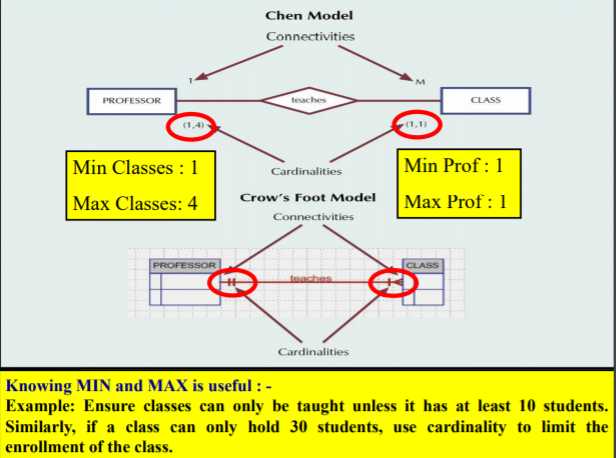
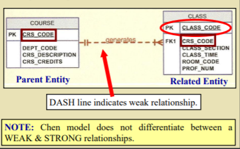
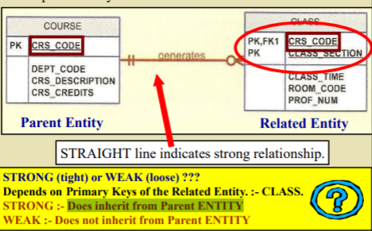
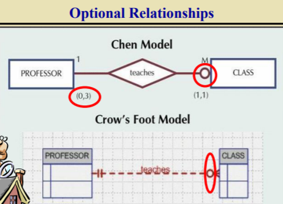

# IntroDB C4: Entity Relationship Modelling

## The E-R Model

- is a **conceptual view.**
- Main components:
  - Entities
  - Attributes
  - Relationships
- Models:
  - **Crow's foot model** <- What we use
  - Chen model
- Documentation:
  

## Entities

- Equals table, not row.
- **Shape: Rectangle.**
- Name: noun, usuall                                                                                                                                                                                                                                                                                                                                                                                                                                                                                                                                                                                                                                                                                                                                                                                                                                                                                                                                                       vc                                                                                                                                                                                                                                                                                                                                                                                                                                                                                                                                                                                                                                                                                                                                                                                                                                                                                                                                                                                                                                                                                                                                                                                                                                                                                                                                                                                                                                                                                                                                                                                                                                                                                                                                                                                                                                                                                                                                                                                                                                                                                                                                                                                                                                                                                                                                                                                                                                                                                                                                                                                                                                                                                                                                                                                                                                                                                                                                                                                                                                                                                               y in capital letters
- Table Row: Entity instance / entity occurrence.

## Attributes

- **Characteristics** of entities: E.g. name
- **Domain.** Set of possible values: E.g. M/F for gender.

### Type of Attributes

1. **Composite attribute**
   - Attributes that can be subdivided to other attributes
     - Eg: ADDRESS => street, area, postcode
2. **Simple/Atomic Attributes**
   - Cannot be subdivided
   - Usually appropriate to change composite to atomic to facilitate detailed queries
3. **Single-valued attributes**
   - Can only have single value
   - Note: not necessary simple attribute, ex: 
     - ID => 01B88; 
       - 01 = birth year, 
       - B = boy,  
       - 88 = 88th baby.
4. **Multivalued attributes**
   1. Can have many values
   2. Draw: double lines
   3. Eg: Employee can have many phone numbers
5. **Derived attributes**
   1. Value calculated from another attribute
   2. Don't need to be stored
   3. Indicate with dotted-line on model.
6. **CAUTION**
   1. Do not implement the multivalued attributes in the relational DBMS.
   2. Solutions:
      1.  Splitting a Multivalued Attributes
      2. Create new ENTITY SET from multivalued attributes

## Relationships

- Association (**linking**) between **entities**
- **Participants**. Entities in a relationship
- **Relationship name.** Active/passive verb in both directions.
- **Connectivity**. Describe classification: **1:1**, **1:M**, **M:N**
- **Cardinality.** Number of entities can be associated with one related entity.

### Relationship strength 

How existence dependence fits into framework. 

- #### Existence-dependent

  - Depend on existence of related entity
  - Without related entity, cannot exist
  - E.g.: Employee & Spouse, without Employee, cannot have Spouse.

- #### Existence-independent

  - Can exist apart from related entities
  - Can 'stand alone'
  - Eg. : Vendor & Part

- **Weak (non-identifying) Relationships**
  - Exist if PK of related entity doesn't contain PK component of parent entity.
  - Does not inherit from Parent ENTITY
    - 
- **Strong (identifying)** relationships
  - Existence-dependent on another
  - Exist if PK of related entity contain PK component of parent entity.
  - Does inherit from Parent ENTITY
    - 

### Relationship Participation (CLARIFY)

- **Optional (Weak Entity)**: Does not require related entity to exist in relationship.
  - Existence-dependent
- **Mandatory (Strong Entity)**: Requires related entity to exist.
  - If **no optionality symbol** is shown, it is mandatory.
  - 