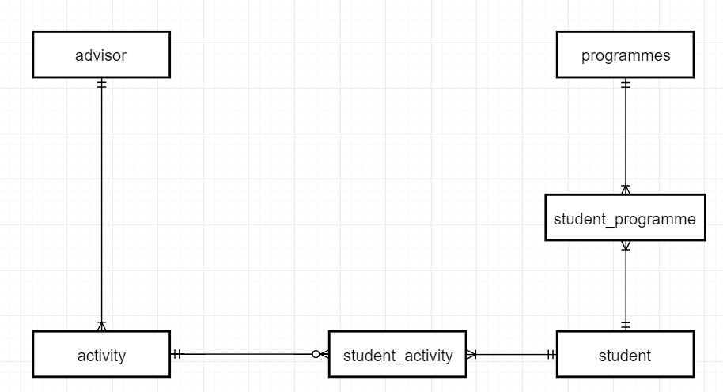

# AACS3013 DB Dev. & Applications

## 13-09-17 PYQ

### Question 1

#### Part A

1. **Meaning**: Data integrity is the assurance of the accuracy and consistency of data inside a database over its entire life-cycle.
   1. Data integrity is maintained by a DBMS through the enforcement of entity, referential, and domain integrity of data inside the database.
2. We cannot do so because of **structural and data dependency**. When the order of data inside the file changes, all programs accessing the files will also need to be modified to suit the new order. This makes the information inflexible, and difficult to scale up or down in the future to suit industry needs.

#### Part B

1. Advantages
   1. The first advantage is **reduced storage size**. DBMS reduces or eliminates data redundancy, less data is stored in the system compared to using a file system.
   2. The second advantage is **better integrity of data.** DBMS ensures the integrity of data is retained throughout the lifetime through the enforcement of entity, referential, and domain integrity of the values inside the database compared to file system whose values can be freely adjusted. 
   3. The third advantage is **better security.** DBMS helps to regulate access to the data stored inside the system and prevents unauthorized access, compared to a file system whose contents can easily be peeked in by anyone with access to the files.
2.  | Data backup                                                  | Data Archiving                                               |
    | ------------------------------------------------------------ | ------------------------------------------------------------ |
    | Duplication of data in anticipation of data loss. Data is duplicated. | Moving of old data to a separate location to make room for newer data. No data is duplicated. |
    
    1. Data backup is important because it helps an organization to survive damages to data with minimal loss. Data archiving is important because it helps an organization to keep cost of storage low when running a system.

### Question 2

#### Part A

The student ID candidate key. This is because student ID helps to keep track of more student details compared to using the NRIC. Queries to search for students can be easily done just by looking at the student ID. The NRIC candidate key makes it difficult to filter students.

#### Part B

1. 
2. DBDL
   1. **advisor**(<u>advisorID</u>, advisorName, contactNo, email)
   2. **activity**(<u>activityID</u>, actDescription, startDate, endDate, advisorID\*)
   3. **student**(<u>stuID</u>, stuName, contactNo, address)
   4. **programmes**(<u>progID</u>, progName, faculty, department)
   5. **student_activity**(<u>activityID</u>\*, <u>stuID</u>\*)
   6. **student_programme**(<u>progID</u>\*, <u>stuID</u>*)

### Question 3

#### Part A

1. **Insertion anomaly**: New record must be added with redundant data.
2. **Modification anomaly**: Inability to maintain data accurately and efficiently. Multi-column changes are required for every change.
3. **Deletion anomaly:** Inability to delete unwanted data without also deleting wanted data.

#### Part B

1. It is not possible to add a new product unless the product is bought by a customer.
2. When we change the prodDesc 'Whiteboard marker' (prodID: S01) to 'Whiteboard marker pen', we also need to update similar columns in the data. If not, it will cause data inconsistency.
3. When we delete the invoice (invoiceNo: A102), we will also delete the product 'A4 size folder' (prodID: F12).

#### Part C

##### 0NF: Unnormalized [Extra]

**Transaction**(<u>invoiceNo</u>, custID, custName, transDate, <u>prodID</u>, prodDesc, quantity, amount)

**1NF: Remove repeating groups**

**Transaction**(<u>invoiceNo</u>, custID, custName, transDate)

**Order**(<u>prodID</u>, prodDesc, quantity, amount, <u>invoiceNo</u>\*)

**2NF: Remove partial dependencies**

**Transaction**(<u>invoiceNo</u>, custID, custName, transDate)

**Order**(<u>prodID</u>\*, quantity, amount, <u>invoiceNo</u>\*)

**Product**(<u>prodID</u>, prodDesc)

**3NF: Remove transitive dependencies** 

**Transaction**(<u>invoiceNo</u>, custID*)

**Customer**(<u>custID</u>, custName, transDate)

**Order**(<u>prodID</u>\*, quantity, amount, <u>invoiceNo</u>\*)

**Product**(<u>prodID</u>, prodDesc)

### Question 4

#### Part A

```mysql
CREATE TABLE vehicle (
	carPlateNo 		CHAR(10),
    vehicleType		VARCHAR(50),
    model			VARCHAR(50),
    yearMade		CHAR(5),
    engineSerialNo	VARCHAR(30),
    ownerID			CHAR(10),
    PRIMARY KEY (carPlateNo),
    FOREIGN KEY (ownerID) REFERENCES owner(ownerID),
    CHECK (year > 1980)
)
```

#### Part B

```mysql
SELECT 		*
FROM 		part P
WHERE		unitPrice > 50
ORDER BY	unitPrice	DESC;
```

#### Part C

```mysql
SELECT 	carPlateNo, ownerName, contactNo, Email
FROM 	vehicle V, owner O
WHERE	model = 'Accord' AND
		yearMade BETWEEN 2001 AND 2005;
```

#### Part D

```mysql
SELECT 	serviceDate, chargeAmt*1.06 AS "GST Amount"
FROM 	service S
WHERE 	TO_CHAR(serviceDate, 'mmyyyy') = '082017';
```

#### Part E

```mysql
SELECT 		P.partID, partDesc, unitPrice, COUNT(serviceID) AS 'Quantity_Used'
FROM 		servCharge S, part P
WHERE		S.partID = P.partID AND
			COUNT(serviceID) > 500
GROUP BY	P.partID, partDesc, unitPrice;
```

