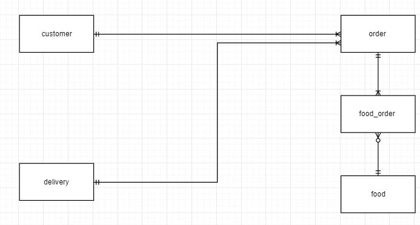

# AACS3013 DB Dev. & Applications

## 21-09-18 PYQ

### Question 1

#### Part A

1. Computer file-based system utilizes files and directories as a structure to store data. Each files containing data are organized in folders and directories.

2. 3 problems:

   1. **Every task need extensive programming.**
      1. Time-consuming, difficult 3GL programming is required to complete tasks based on a file-based system.
   2. **Structural dependency**
      1. Once the file structure changes, data access method also require changes.
   3. **Data dependency**
      1. Change in the metadata of data require change in all the programs that access the file.

#### Part B

1. 3 DBMS function ensuring integrity and consistency of data
   1. **Database Dictionary Management**: Defines entities and their relationships
   2. **Database storage management:** Store data and their metadata
   3. **Database transformation and presentation:** Translate logical requests into requests to obtain data
2. 3 potential threats to data security
   1. Accidental damage
   2. Theft and fraud
   3. Loss of privacy

### Question 2

#### Part A

Defining clear set of business rules

**Benefit 1**: Reducing costs. It is easier to train employees to use the database when all rules are explicitly stated in the system, rather than requiring the employees to memorize them.

**Benefit 2:** Reusability. By defining clear set of business rules, they can be reused in multiple queries without requiring reevaluation of unclear business rules.

#### Part B

1. 
2. DBDL Format
   1. **customer**(<u>custId</u>, custName, custContact, email)
   2. **order**(<u>orderNo</u>, orderDate, orderAmount, remarks, custId\*, deliveryNo\*)
   3. **food**(<u>foodId</u>, description, price, restaurantName)
   4. **delivery**(<u>deliveryNo</u>, vehicleNo, staffName, staffContact, deliveryTime)
   5. **food_order**(<u>orderNo</u>\*, <u>foodId</u>\*)

### Question 3

#### Part A

1. **Primary key**: An attribute or a group of attributes of a table that uniquely identifies a row on a table.
2. **Foreign key:** An column that derives its value from another table, and forms a link between two tables.

#### Part B

1. **Insertion anomaly**: A new item cannot be added without adding another customer.
2. **Modification anomaly:** By modifying the description of item code CO98 from 'Phone case' to 'Colorful Phone case', similar items with same description will also need to be modified. If not, will cause data inconsistency.
3. **Deletion anomaly:** By deleting the customer 'AMD Sdn Bhd' (CustID: AMD12), we will also delete the Item with  Description, 'Dust plug' (ItemCode: DP12).

#### Part C

##### (Extra) 0NF: Unnormalized

**PurchaseDelivery**(<u>DeliveryOrderNo</u>, DeliverOrderDate, CustId, CustName, Address, <u>ItemCode</u>, Description, Qty)

**1NF, Remove repeating groups**

**Delivery**(<u>DeliveryOrderNo</u>, DeliverOrderDate, CustId, CustName, Address)

**Purchase**(<u>ItemCode</u>, Description, Qty, <u>DeliveryID</u>\*)

**2NF: Remove partial dependencies**

**Delivery**(<u>DeliveryOrderNo</u>, DeliverOrderDate, CustId, CustName, Address)

**Purchase**(<u>ItemCode</u>\*, Qty, <u>DeliveryID</u>\*)

**Item**(<u>ItemCode</u>, Description)

##### 3NF: Remove transitive dependencies

**Delivery**(<u>DeliveryOrderNo</u>, DeliverOrderDate, CustId\*)

**Customer**(<u>CustId</u>, CustName, Address)

**Purchase**(<u>ItemCode\*, Qty, <u>DeliveryID\*</u>)

**Item**(<u>ItemCode</u>, Description)

### Question 4

#### Part A

```mysql
CREATE TABLE ExamGrade (
  StudentID  	CHAR(12),
  SubjectCode  	CHAR(16),
  SemesterYear  CHAR(10),
  Marks 	 	DECIMAL(5, 2),
  Grade  		CHAR(2),
  ExamFees 		DECIMAL(7, 2),
  PRIMARY KEY 	(StudentID, SubjectCode, SemesterYear),
  FOREIGN KEY 	(StudentID) REFERENCES Student(StudentID),
  FOREIGN KEY 	(SubjectCode) REFERENCES 	Subject(SubjectCode),
  CHECK 		(Marks > 0 AND Marks <= 100)
);

```

#### Part B

```mysql
SELECT  *
FROM	Subject S, Faculty F
WHERE	S.FacultyId = F.FacultyId AND 
		F.FacultyName = 'Computer Science Faculty';
```

#### Part C

```mysql
SELECT 	COUNT(*) AS 'No. of Students'
FROM 	ExamGrade E, Subject S
WHERE	E.SubjectCode = S.SubjectCode AND
		S.SubTitle = 'Database Development and Applications' AND
		E.SemesterYear = '2018Sem1';
```