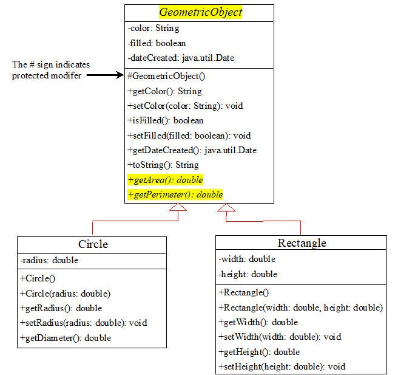

# OOPT - C7: Abstract Classes & Interfaces

## 1. Introduction

### Inheritance hierarchy

- A class hierarchy, think of it as a **tree diagram**
  - **More specific:** Moving down the tree
  - **More general:** Moving up the tree
- **Abstract class:** superclass can have zero specific instances

### Abstract methods

- `GeometricObject`, is a superclass of `Circle` and `Rectangle`
  - models common features for geometric objects
- All geometric objects have computable areas and perimeters. However, all of them have different formulas to calculate them. 
  - Therefore, the best `GeometricObject` can do, is to declare that all geometric objects have calculatable areas, by providing **abstract methods** for calculating the area and the perimeter. (Similar to method declaration)
  - The actual calculation's **method implementation** need to be defined/implemented by more concrete classes, like `Circle` and `Rectangle`. (Similar to method definition)
- *Abstract methods can only exist in abstract classes*

### Abstract class in UML

- Names & methods are *italicized*
- Extra: the `#` sign indicate protected modifier



- The constructor in the abstract class is declared **protected** because it is used only by its subclasses.
- **getArea()** and **getPerimeter()** are defined as **abstract methods.** Because `GeometricObject` is too general.

## `abstract` Modifier

### `abstract` class

- Cannot be instantiated, should be extended. 
  - cannot use `new` on abstract class.
- Can contain `abstract` methods. 
- **All subclasses must implement all abstract methods**, or be an abstract class
- **Constructor** can be defined in subclasses.
- **Superclass** can be concrete.

#### `abstract` methods: 

- Signature without implementation, implementation by subclass, can only exist within `abstract` class.

### Advantages

- Ensure `abstract` methods are implemented by subclasses
- Can invoke abstract methods on superclass using general name

## 6. Interfaces

- Class with only **constants** and **abstract methods**

- Difference with abstract class: no variables & concrete methods

### Usefulness

- Can specify behavior

### Syntax

```java
public interface interfaceName {
    ... /* Constants + Abstract methods */
}
```

- **Data fields:** Must be `public final static`, can be omitted
  - Eg: `public static final int K` is same as `int K`
- **Methods:** Must be `public abstract`
  - Eg: `public abstract void p();` is same as `void p();`

## 7. `Comparable` Interface

- Defines natural order for objects
- Allows for comparison between instances of two concrete classes.

- **UML Notation:** Interface name and methods are *italized*. **Dashed lines and hollow triangles** to point to interface.

### Syntax

```java
public class ClassName extends SuperClassName {
    implements Comparable {
        /* Constructs a ClassName with specified properties for comparison use */
        public ComparableClass(...) {
            ...
        }
    }
    
    public int compareTo(Object o) {
        /* Compare an object with the specific properties inside the ComparableClass(...) */
        public ... compareTo(Object o) {
            ... ComparableClass.getProperty();
        }
    }
}
```

## Exam Tips

In Exam, uml NEED TO know difference between italic and non-italic font
Difference between interface and abstract
Difference between abstract and concrete class

Exam won't ask for cloning

Exam won't ask for sorting

From Chapter 7 Part 2 onwards, the topics are optional

- 