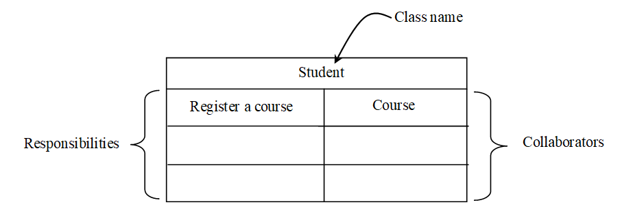
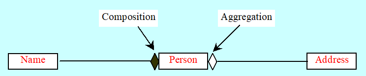
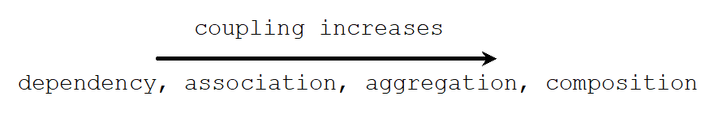

# Chapter 8 - OO Principles

## 1. Introduction

### Steps involved in Class Design

**1. Identify classes**

**2. Describe attributes and methods.**

**3. Establish relationships.**

**4. Create classes.**

## 2. Discovering Classes

- model the application in terms of *cooperative objects*
- **Class abstraction**: decompose problems into related classes
- **Method abstraction:** Design individual class
  - Identify and determine responsibilities

### Steps

1. Look for nouns to identify classes
2. Determine responsibilities (methods), look for verbs, and match with objects

### Strategies

- Use CRC cards (Classes, Responsibilities, Collaborators)
- Use index card similar to below:

## 3. Discovering Class Relationships

Common relationships among classes:

- Association
- Aggregation
- Dependency 
- Inheritance

### Association

- general binary relationship
- describes an activity between two classes. 
- May exist between objects of same class.

### Aggregation

- special form of association, which represents an ownership relationship between two classes
- Composition: If an object is exclusively owned by an aggregated object, the relationship between the object and its aggregated object is referred to as composition (Eg: Name)
- 

### Dependency

- a relationship between two classes where one (called client) uses the other (called supplier). 
- In UML, draw a dashed line with an arrow from the dependent class to the independent class.

### Coupling

### Dependency vs Association

#### Similarity

- Both describe one class depending on another

#### Differences

|                           | Association                                                  | Dependency                                                   |
| ------------------------- | ------------------------------------------------------------ | ------------------------------------------------------------ |
| **Relationship**          | **Stronger**                                                 | **Weaker**                                                   |
| **Description**           | **The  state of object changes when its associated object changed** | **The client object and the supplier object are loosely coupled** |
| **Java   Implementation** | **Date   Fields**   **Methods**                              | **Methods   ONLY**                                           |

- If class A contains a method with a parameter whose type is a class B, A is said to be dependent on B.

- If class A contains a data field whose type is class B, the relationship between the classes is association

### Inheritance

- strong is-a relationship between two classes. 

### Interfaces

- A weak is-a relationship can be represented using interfaces. 

## 3. Class Design Guidelines

- Cohesion 
- Consistency 
- Encapsulation 
- Clarity
- Completeness
- Instance vs. Static 
- Inheritance vs. Aggregation
- Interfaces vs. Abstract Classes

### A. Cohesion

- A class should describe a single entity. 
- Should logically fit together to support a coherent purpose.

### B. Consistency

- Follow standard Java programming style and naming conventions. 
- Provide a public no-arg constructor and override the equals method and the toString method defined in the Object class whenever possible. 

### C. Encapsulation

- should use the **private** modifier to hide its data from
  direct access by clients. 
  - can use get and set, but only to ones you want user to see/modify
- should also **hide methods not intended for client use**

- two contracts – one for the **users (clients)** of the class and one for the **extenders** of the class. 
  - private/public: users
  - protected: extenders

### D. Clarity

- Implement cohesion, consistency and encapsulation to help achieve clarity.  
- Classes are designed for reuse. 
  - no restrictions on what or when the user can do with it
- not declare a data field that can be derived from other data fields

### E. Completeness

- designed for use by many different customers.
  -  provide a variety of ways for customization through properties and methods

### F. Instance vs Static

- dependent on a specific instance of the class, **instance**
- shared by all, **static**
  - can also have set/get methods
  - refer through class name
  - don't pass parameter to initialize static, better to use set methods.

### G. Inheritance vs Aggregation

- **is-a:** Inheritance. Eg: Apple *is-a* fruit
- **has-a:** Aggregation. Eg: Apple has-a cell

### H. Interfaces vs Abstract Classes

- Both specify common behavior
- **strong is-a:** **Abstract class**, cause clearly describe parent-child
- **weak is-a:** a.k.a. *is-kind-of* relationship, use **interfaces**, cause possesses certain property
  - Eg: All shapes *is-kind-of* comparable using their areas, and therefore, the **comparable** class should be an interface

#### Interfaces

- More flexible
  - Can extend many interface
- Cannot contain concrete methods
- can be combined with abstract class with a companion abstract class implementing the interface

#### Packages

- Organize classes
- Syntax (at beginning of program): `package packageName;`
- By default: placed in `default` package

#### Reasons to use

- To locate classes: Make it easier to locate
- Avoid naming conflicts: Prevent naming conflicts between reusable classes, only allow name to be referenced inside packages.
- Distribute software conveniently
  - Package group related classes
- Protect classes
  - Protected members are accessible to classes in same package, not to external classes

#### Package Naming Conventions

- hierarchical, can have packages inside packages, ensure uniqueness
- by convention, all in lowercase

#### Package-Folder Mapping

- Java expects one-to-one mapping of package name and file system directory structure
  - Means all packages must exist according to sequence, cannot skip any
    - Eg: `com.prenhall.flickshots` must have a folder called `com` containing `prenhall` containing `flickshots`

#### Using class from packages

- Use **import** statements
  - Syntax: `import packagedirectory.*;`
  - **import on demand declaration**, import using `*`
- Import specific class
  - Syntax: `import java.util.Scanner;`

## 5. Java API

- Not that malay word *api* :fire: please, we don't need a :fire_engine: here.
- Application Program/Programming/Programmer Interface
- Establishes framework :building_construction: to develop applications
  - Must follow conventions and rules, AKA *framework-based programming*
- Best way to develop useful programs: ~~copying~~ imitate good examples.

## 6. Design Patterns

- Benefit of OOP: Code reuse
- Don't have to reinvent the wheel
- Using successful patterns to develop new software without creating strategies (eg: buttons)
- Eg: `Singleton` pattern, restrict class instance to one object
  - Eg: System can have many printer, but one printer should have one spooler.

## 7. Immutable Objects and Classes

- **Immutable**: contents cannot be changed once created
- Time to exercise some design patterns:
  - `A` definition: contents cannot be changed once created
  - **Immutable object:** Objects which `A`
  - **Immutable class:** Classes which `A`
  - Just replace `Pattern` with the `A` definition
- Example, delete a `setter` for a `private` data field
- Criteria to be immutable
  - All data fields are `private`
  - No mutator methods
  - No accessor methods, returning a reference to mutable data field objects
    - Therefore, class with all `private` data, without mutators is not necessary immutable

## Exam Tips

Take note:

- Dotted line = implement
- Solid line = extend