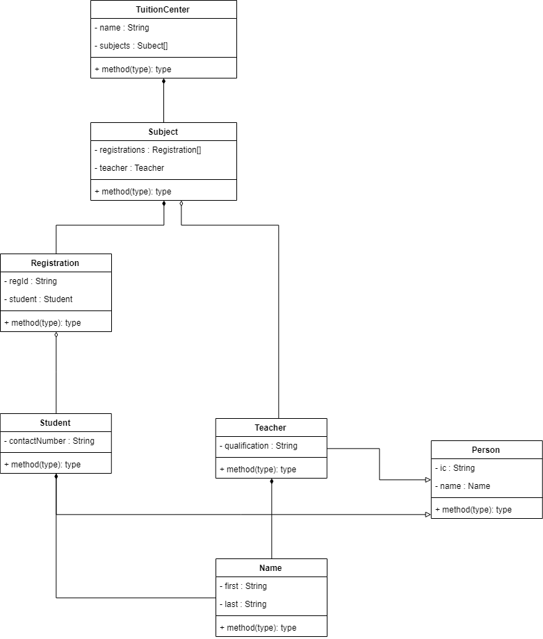

# OOPT PYQ 09/2017

## Question 1

### Part A

1. **Inheritance**: Inheritance is a mechanism in which one class is derived from an existing class, hence acquiring all the properties of the derived class.
2. **Polymorphism:** Polymorphism is the ability of classes to redefine methods for derived classes.
3. **Encapsulation:** Encapsulation describes the idea of bundling data and methods that work on daa in one unit.

### Part B

1. `public`. The class, data, or method is visible everywhere.
2. `private`. The class, data, or method is visible only inside the class.
3. `protected`. The class, data, or method is only visible inside the class and its subclasses.
4. `default`. The class, data, or method is visible only inside the package which contains the class.

### Part C

```java
public static boolean verifyPassportNo(String passportNo) {
        if (passportNo.length() != 9) {return false;}
        if (passportNo.charAt(0) != 'A' && passportNo.charAt(0) != 'H' && passportNo.charAt(0) != 'K') {return false;}
        for (int i = 1; i < passportNo.length(); i++) {
            if (!Character.isDigit(passportNo.charAt(i))) {return false;}
        }
        return true;
    }
```

## Question 2

### Part A

```java
package PYQ.y2017;

public class Ticket {
    private String ticketId;
    private String park;
    private String ticketType;
    private double price;
    private static int totalNoOfTicket;

    public Ticket() {
        totalNoOfTicket++;
    }

    public Ticket(String ticketId, String park, String ticketType, double price) {
        this.ticketId = ticketId;
        this.park = park;
        this.ticketType = ticketType;
        this.price = price;
        totalNoOfTicket++;
    }

    public String getTicketId() {
        return ticketId;
    }

    public void setTicketId(String ticketId) {
        this.ticketId = ticketId;
    }

    public String getPark() {
        return park;
    }

    public void setPark(String park) {
        this.park = park;
    }

    public String getTicketType() {
        return ticketType;
    }

    public void setTicketType(String ticketType) {
        this.ticketType = ticketType;
    }

    public double getPrice() {
        return price;
    }

    public void setPrice(double price) {
        this.price = price;
    }

    public static int getTotalNoOfTicket() {
        return totalNoOfTicket;
    }

    @Override
    public String toString() {
        return String.format("Ticket id: %s\n" +
                "Park: %s\n" +
                "Ticket type: %s\n" +
                "Price: RM%4.2f\n", ticketId, park, ticketType, price);
    }
}
```

### Part B

```java
package PYQ.y2017;

public class TicketDriver {
    public static void main(String[] args) {
        Ticket t = new Ticket();
        t.setTicketId("P01C");
        t.setPark("Water Park");
        t.setTicketType("Children");
        t.setPrice(20);

        Ticket t2 = new Ticket("P02A", "Adventure Park", "Adult", 45);

        System.out.println(t);
        System.out.println(t2);

        System.out.println("Total no. of tickets: " + Ticket.getTotalNoOfTicket());
    }
}

```

## Question 3

### Part A

```java
public abstract class DataPlan {
    protected String planId;
    protected String planName;
    protected int dataSize;
    protected double price;

    public DataPlan() {
    }

    public DataPlan(String planId, String planName, int dataSize, double price) {
        this.planId = planId;
        this.planName = planName;
        this.dataSize = dataSize;
        this.price = price;
    }

    @Override
    public String toString() {
        return String.format("Plan id: %s\n" +
                "Plan name: %s\n" +
                "Data size: %dGB\n" +
                "Price: RM%4.2f\n", planId, planName, dataSize, price);
    }
}
```

### Part B

```java
public class PostpaidPlan extends DataPlan {
    private int freeTalkTime;
    private int freeSms;

    public PostpaidPlan() {
    }

    public PostpaidPlan(String planId, String planName, int dataSize, double price, int freeTalkTime, int freeSms) {
        super(planId, planName, dataSize, price);
        this.freeTalkTime = freeTalkTime;
        this.freeSms = freeSms;
    }

    public String toString() {
        return "Postpaid Plan\n" +
                super.toString() +
                "Free call: " + freeTalkTime + " minutes\n" +
                "Free sms: " + freeSms + " sms" + "\n";
    }
}
```

### Part C

```java
public class DataPlanDriver {
    public static void main(String[] args) {
        DataPlan[] dataPlans = {new PostpaidPlan("POS89", "Happy Moments", 15, 78, 200, 1000),
        new PrepaidPlan("PRE153", "Smart Traveler", 3, 28, 7)};

        for (DataPlan d : dataPlans) {
            System.out.println(d);
        }
    }
}

```

## Question 4

### Part A

1. Restrictions

   1. Interface can only have constants.
   2. Interface can only have abstract methods.
   3. Interfaces can only extend other interfaces, but cannot implement them.

2. ```java
   public interface Discount {
       double DISCOUNT_RATE = 0.05;
   
       double calTotalDisc();
   }
   ```

3. ```java
   public class PaymentTransaction implements Discount {
       private double totalPurchase;
   
       @Override
       public double calTotalDisc() {
           return totalPurchase * DISCOUNT_RATE;
       }
   }
   ```

4. 

   1. 
   2. Notes:
      1. Assumption: 1 teacher per subject
      2. Question did not state need methods, so I'm not including, but I'm double-confirming with teacher, let me know if you know something else.

