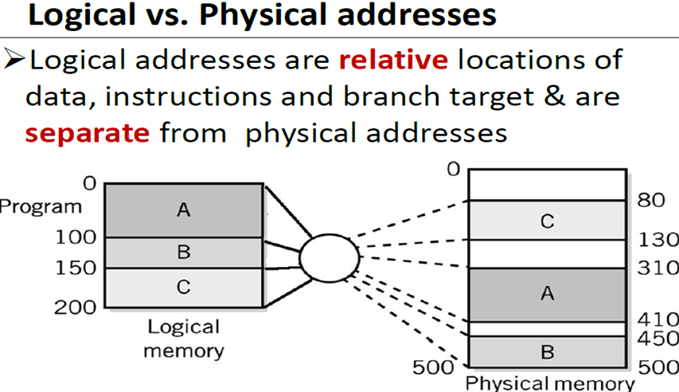
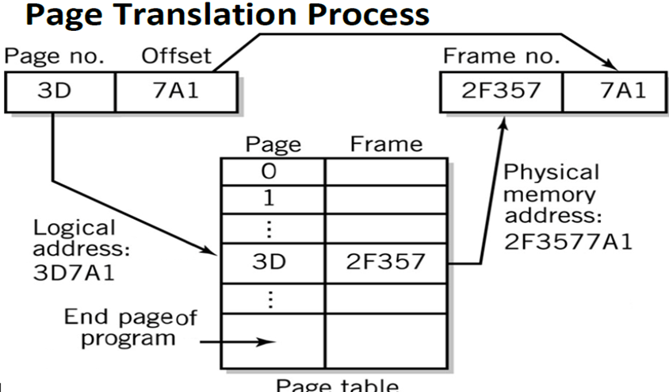

# CSA C12: Performance Enhancement

## 1. Enhancement & Optimization

### Multiple CPU

- **Multiprocessors.** Multiple CPUs in single system. 
- Not necessarily increase performance
  - Overhead to distribute work
  - Conflict in sharing resources

### Faster clock speed

- Speed up instruction cycle of system, affect performance

### Wider instruction & data paths

- More instruction per operation
- Reduce disk access
- Allow CPU to pipeline or use instruction pools.

### Faster disk access

### Memory access time

- Provide more registers (reduce access instructions)
- Apply faster memory (cache)

### Increase & speed up memory

- Increase memory: Larger buffer to hold data while processing
- Faster memory: Reduce time to access instructions in memory

### Disk access

- Minimize disk access
- Data place in different disks, access simultaneously

## 2. Multiprocessing

- Types:
  - Tightly-coupled system
  - Loosely-coupled system

### Tightly coupled system

- Multiprocessor systems
- Tightly-coupled configuration.
- Same program & data
- Program execution divided between CPU
- Each CPU operates independently.

#### Configuration

- Master-slave multiprocessing
  - One CPU is "master": Manage system, control resources, scheduling.
  - Master allocates task to other "slave" CPUs
  - Advantages:
    - Simple
    - Better protection
  - Disadvantages:
    - Low reliability
    - Delay in scheduling
    - Heavy burden on master
- Symmetrical multiprocessing (SMP)
  - Each CPU equal resources
  - Each CPU determine what to run using algorithm
  - Advantages:
    - High reliability
    - Easy fault-tolerant support
    - Balanced workload
  - Disadvantages:
    - Resources conflicts
    - Complex implementation

### Loosely-coupled systems

- Clusters OR Multi-computer systems
- Each system complete itself, have own resources.
- Each system called **node of the cluster**.

- Data communication provide link

#### Advantages

- Fault-tolerant
- Scalable
- Well balanced
- Eliminate distance issue

## 3. Memory Enhancement

### DRAM

- Inexpensive, large size, but too slow.

### SRAM

- 2-3 times faster than DRAM. 
- More expensive, small size.

### Approaches

- Wider Path Memory Access: Multiple bytes at 1 time
  - Disadvantages: Increased complexity to locate memory
  - Widely used because of simplicity
- Memory interleaving: Partition memory into subsections, each with own address & data register
  - Each part have own MAR & MDR
  - Can be accessed simultaneously if different blocks
- Cache memory
  - High-speed memory
  - Invisible to programmer, cannot be directly addressed
  - Organized into blocks. Hold exact reproduction of a part of memory.
  - Holds a tag. Tag identifies location of duplicated parts in main memory.
  - **Cache controller**: Hardware to check tags
  - **Cache line**: Unit of transfer
  - **Hit Ratio**: Ratio of hits out of total requests

### Expanded Memory

- Provide extra RAM
- Slower than main memory, larger size
- Buffer between main memory and hard disk, reduce disk access.
- Works independently, not affected by others.

## 4. Virtual storage

- Virtual memory
- Referred to as **logical address**. No reality outside program.
- Actual memory called **physical address**.

- Dynamic mapping: Address mapping can be changed any time to meet different conditions. Memory management.

- Virtual storage:
  - Segmentation
    - Lookup tables, with starting address & size of blocks
    - Physical location = start + offset
  - Paging
    - Managed by OS
    - Built into hardware
    - **Page**: logical block ​corresponds to​ **Frame**: physical block.

- Logical address: relative location, separate from physical address. Memory management map them.
  - 

- Virtual storage: Increase perceived amount of memory available.

### Capabilities

- Relocation of programs easily. Good for multitasking.
- Split program into smaller pieces, can load into memory.

- Multiple programs can have different physical location, but same logical address.
- Make program think itself has more memory.

### Page Address Layout

- 20-bit: Page Number : Offset

### Advantages

- Program share memory space
- Multiple programs run at once
- Program can run even if cannot fit in all at once
- Process separation

### Disadvantages

- Take up space on disk
- Paging takes CPU resources

## 5. Parallel Computers

- Use many CPU connect together
- Each CPU has small **local memory**, and share global **shared memory**
- Pipelining: Result from one CPU flow to the next for additional processing
- Example: Image processing, data searching

