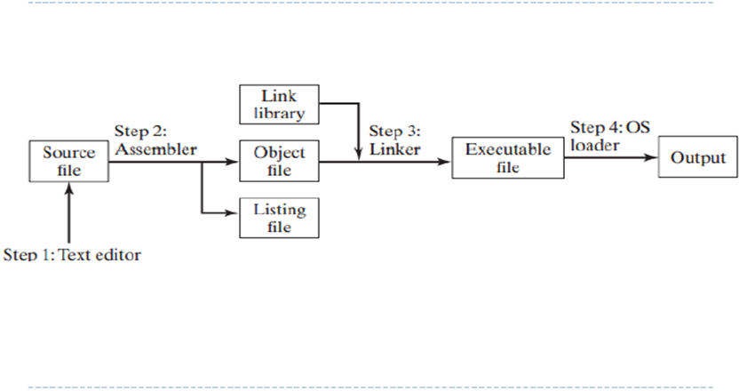
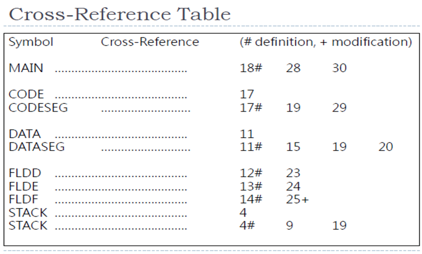
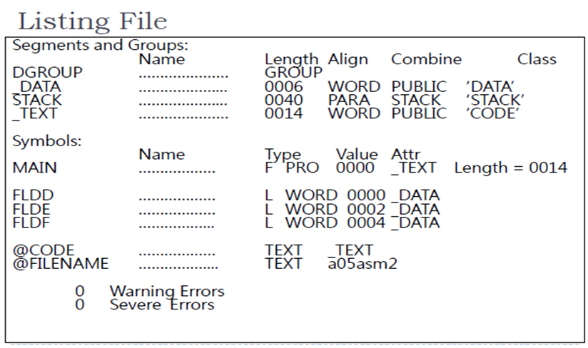

# CSA C6: Assembling, Linking, Executing Program

## 1. Preparing program for assembling & execution

- Assembler is similar to compiler
- Assemble-Link-Execute Cycle
  - 

- Source file extension: .ASM

### STEP 1: Editor

- Programmer create **source file**
- **Extension**: .ASM

### STEP 2: Assembly

- **Assembler** 
  - convert source file :arrow_right: object file AND/OR Listing file
- **Object file:** Machine translation of program
  - `.OBJ` file
- **Listing file:** If any errors occur, return to step 1.
  - `.LST`, `.CRF` file

### STEP 3: Linking

- Linker 
  - reads object
  - replace any calls to procedures in link library with the actual code
  - produce executable
- `.OBJ `:arrow_right: `.EXE`

### STEP 4: Loading

#### Loader

- Creates Program Segment Prefix (PSP): Indicate state of program
- Reads executable into memory
- Branches CPU to starting address
- Execute program

## 2. Assembling source program

- Assembler converts source statements into machine code, display error on screen
- Typical errors:
  - Name violating naming conventions
  - Operation incorrect spelling
  - Undefined operands
- Optional error output fules:
  - `.LST` listing: Examine generated code. Contains error diagnostics
  - `.CRF` cross reference: See which instruction references which data item
    - Requesting CRF cause assembler to generate statement numbers referring to LST.

#### Cross-reference listing

- Cross-reference listing of identifiers or symbols
- Still have to convert file to properly sorted cross-reference.

#### Cross-reference table

- First column symbols: Alphabetical
- Second column: Line numbers of symbols definition
- Numbers to the right: Line number showing where symbols are referenced by other statements.

- Example:

  

  - Examples:
    - `CODESEG` defined in line 17, referenced in line 19 and 29
    - `FLDF` defined in line 14, referenced in line 25+ (where `+` **means value modified during execution**)

  #### Listing File

  

- First part under "segment and groups"
  - Show 3 segments renamed by assembler, listed alphabetically. Data, stack, code (text) segment
  - Note, all is Hex, that means 40H is 64 bytes

- "Symbols"
  - Names defined in program OR default names
  - Default names: `@Code`, `@FILENAME`.
    - Can be used in `ASSUME`  and executable statement

### Symbols

- Useful to identify code, but not necessary
- Code with symbol name
  - `dword ptr [x] 0`  
- Code without symbol name
  - `dword ptr [ebp-8], 0`

### Using Simplified Segment Definitions

- Predefined equates, begin with `@`, free to reference in program.

- For simplified segment directives, initialize DS as follows:

  ```assembly
  MOV AX, @data
  MOV DS, AX
  ```

### Two-pass assembler

- Multiple passes through source program
- Resolve forward reference (addresses not encountered yet)

#### Pass 1

- Read entire source program, construct symbol table
- Determine code to be generated

#### Pass 2

- Use symbol table to complete object code for instructions

## 3. Linking Object Program

- Link object module produced by assembler
- Combines multiple modules into one executable program
- Generate .EXE module
- Output: `.EXE`, `.MAP`, or `.LIB`

### Link Map

- Rearrange segments in alphabetical order

## 4. Executing Program

### Tracing Programs - View segments

- Stack segment: `D SS:0`
- Code segment: `D CS:0`
  - The assembled listing from here is NOT accurate. The assembly do NOT know address of operands

## 5. Error diagnostics

Nothing important

## 6. The assembler program counter

- Assembler maintains location counter to keep track defined items in DS

- Initially 0, advance by number of bytes

- Ways to change value in LC:

  - EQU: Redefinition
  - ORG: Begin at offset
  - EVEN/ALIGN: Align address on even-numbered boundary

  

  

  

