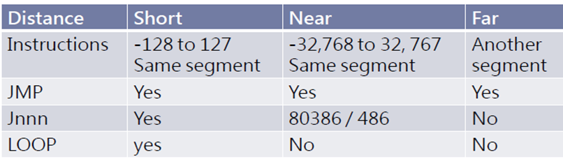

# CSA C8: ASM Fundamentals II

## 1. Arithmetic

### `MUL` instruction

- Multiplication ONLY on unsigned data.

- Affect carry & overflow

- Syntax:

  - Byte times byte (8bit) - AH \* AL = AX. Use `MUL CL`
  - Word times word (16-bit) - DX \* AX = DXAX. Use `MUL BX`

#### Example

```assembly
.CODE
	MOV AL, var1 ; byte * byte
	MUL	var2
	
	MOV AX, word1 ; word * word
	MUL word2
	
	MOV AL, var1  ; byte * word
	SUB AH, AH
	MUL	word1
```

### `DIV` instruction

- Unsigned data division

#### Syntax

- Dividend: `AX` or `DX:AX` 
- Quotient: `AL` (byte) or `AX` (word)
- Remainder: `AH` (byte) or `DX` (word)

#### Example

```assembly
.CODE
	; doubleword / word
	MOV DX,0
	MOV AX, 8003H
	MOV CX, 100H
	DIV CX
```

- `AX` = 80
- `DX` = 3

### `CBW` instruction

- YOUTUBE PLS (convert byte into word)
  - Sign-extends (if sign is 1, then extend all 1s, vice versa)

### Shifting

- `SHL` (shift bits left)
  - sometimes change carry flag
  - 0 shifted in MSB.
  - Multiply by 2^n^
- `SHR` (shift bits right)
  - sometimes enter carry
  - 0 shift in LSB.
  - Divide by 2^n^

#### Format

```assembly
SHL destination, 1/CL
```

## 2. Multiple Initializers

- Label is offset from first item.

## 3. Direct-Offset Operands

-  Add displacement to name of variable

```assembly
alist DB	10,20,30
	  DB	40,50,60
```

- Access implicit labelled memory locations.

```assembly
MOV AL, [arrayB + 1]
```

- Supports different radixes.

#### Defining Data

- If you want to allocate 16-bit
  - `myList DW 1,2,3,4,5`

## 4. Data-related ops & directives

### `DUP` operator

- Allocate storage for items using constant expression as counter.
- Useful for string/array

````assembly
array1 DB 20 DUP(0)		; 20 bytes w/ 0 array2 DB
20 DUP(?)				; 20 bytes, unintialized
array3 DB 2 DUP("STACK"); "STACKSTACK"
array4 DB 5, 4, 3 DUP (2, 3 DUP(0), 1)
````

### `Offset` operator

- Return number of bytes between label & beginning
- Destination must be 16-bit operand.

### `LENGTHOF` operator

- Count number of elements in array, defined by value on same line as label

### `ALIGN` operator (CHECK ONLINE)

- Align variable on type boundaries.

#### Example

````assembly
bVal	BYTE	?		; 00404000
ALIGN	2			
wVal	WORD	?		;
bVal2	BYTE	?		;
ALIGN	4
dVal	DWORD	?		;
dVal	DWORD	?		;
````

### `SIZEOF` Operator

- Return bytes array take up
- Multiplying `LENGTHOF` by `TYPE`

```assembly
.DATA
	intArray DW 32 DUP(0)
.CODE
	MOV	AX, SIZEOF intArray ; AX = 64
```


## 5. Indirect Operands

- Register containing offset for data in memory location.
- Can only use `SI`, `DI`, `BX` or `BP`. Avoid `BP` unless using it to index to stack.

```assembly
.DATA
	byteVal DB 10h
.CODE
	MOV SI, OFFSET byteVal
	MOV	AL, [SI]			; AL = 10h
```

### Manipulating Array

```assembly
.DATA
	arrayA	DB	10H, 20H, 30H
.CODE
	MOV SI, OFFSET arrayA
	MOV AL, [SI] 			; AL = 10H
	INC	SI
	MOV	AL, [SI] 
	INC	SI
	MOV AL, [SI]
	INC	SI
```

- For 16-bit arrays, you want to use `ADD SI, 2` instead of `INC SI`

### `LEA` instruction

- Load Effective Address
- Initialize register with offset address

#### Example

```assembly
.DATA
	dataTable	DB	25	DUP	(?)
	DB	?
.CODE
	LEA	BX, dataTable	; equivalent to
						; MOV BX, OFFSET dataTable
	MOV	BYTEFLD, [BX]
```

## 6. Unconditional Jump & Loop

### `JMP` instruction

- Unconditional jump:
  - Transfers control regardless of circumstances
  - Allow transfer control to target address (labelled instru.)
- Format:
  - `JMP short/near/far address`
- Types:
  - Backwards jump (Label behind `JMP` instruction)
  - Forward jump (Label in front of `JMP`  instruction)

### Instruction labels

- Labels are required for redirection.

#### Example

```assembly
		JMP A90
		...
A90:	MOV AH, 00
		...
```

### Limitations



### `LOOP` instruction

- Repeats block of statement `n` times
- `CX` automatically used as counter, decrement every repeat
- Syntax: `LOOP shortAddress`

#### Execution

```pseudocode
CX --
if (CX != 0)
	jump to the target address.
```

#### Example (Single LOOP, sum of integers)

```assembly
	MOV	AX,	00H	;	AX = 0
	MOV	CX,	05  ;	CX = 5
L1:
	INC AX		;   Add 1 to AX
	LOOP L1
```

#### Example (Nested Loop)

```assembly
.DATA
	count DW	?
.CODE
	MOV	CX,100
L1:
	MOV count, CX ; save outer loop count
	MOV CX, 20	  ; set inner loop count
L2:
	...
	LOOP L2		  ; repeat inner loop
	MOV	CX, count ; restore outer loop count
	LOOP L1 	  ; repeat outer loop
```

### Example (Conclusion)

```assembly
.DATA
	arrayNum	DB	10H, 20H, 30H, 40H
.CODE
	MOV	DI, OFFSET		arrayNum	; address
	MOV	CX, LENGTHOF	arrayNum	; loop counter
	MOV	AX, 0						; reset accumulator
L1:
	ADD AL, [DI] 		; add integer
	INC	DI				; point to next
	LOOP L1
```

