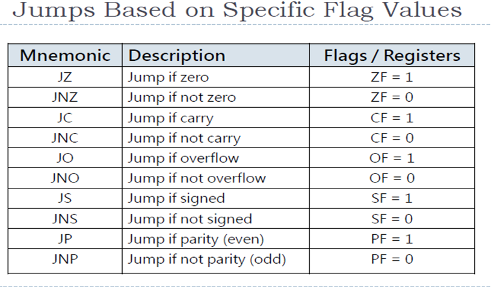
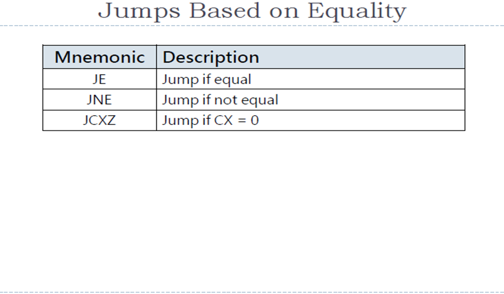
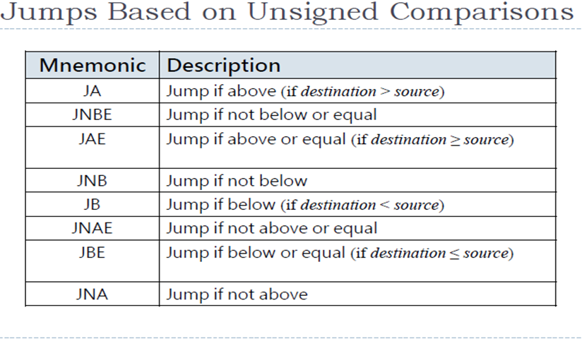
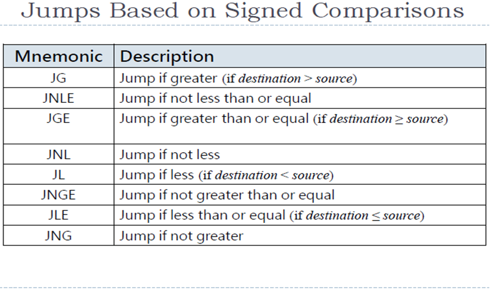

# CSA C9: Conditional Processing

## 1. Boolean & Comparison Instruction

- `AND`, `OR`, `XOR`
  - Syntax: `OPERATOR destination, source `
- `NOT` (1's complement)
  - Syntax: `NOT register/memory`
- `TEST` (set like `AND` but don't modify destination)
- `CMP`: Compare, perform implied subtraction
  - Syntax: `CMP destination source`
  - For unsigned operands:
    - `CF`  is set if source > destination
    - `ZF`  is set if destination = source
    - Else nothing is set
  - For signed operands:
    - Destination < source: `SF` flag not same as `OF`
    - Destination > source: `SF` flag = `OF` flag
    - Destination = source: `ZF = 1`

### Test Examples

- Test if any leftmost bits is non-zero:
  - `TEST BL, 11110000B`
- Test if `AL` contain odd number
  - `TEST AL, 000000001B`
- Test if `DX` contains 0
  - `TEST DX, 0FFH`

## 2. Conditional Jumps

- Combine comparison + jumps
- 2 steps:
  - `CMP`/`AND` modify CPU status flag
  - Conditional jump test flag, cause branch to new address.

### Conditional Flags

#### 







## Testing Multiple Conditions

- Nested if-statements

```assembly
		CMP	 	AL, BL
		JNE		not_equal
		CMP		AL, BH
		JNE		not_equal
		CMP		AL, CL
		JNE		not_equal
		
equal:	
		<processing>
		...
		
not_equal:
		<processing>
```

## 3. Conditional Looping

### `LOOPZ`  and `LOOPE` instructions

- Loop if zero and loop if equal
- Like a while loop
- Useful for scanning purpose
- Inverses: `LOOPNZ`, `LOOPNE`

### Example

```assembly
.DATA
	myData		BYTE	1,2,3,4
	total		BYTE	0
.CODE
	MOV		AX, 0
	MOV		BX, OFFSET myData
	MOV		CX, 03H
A20:
	ADD 	AL, [BX]
	INC		BX
	DEC		CX
	JNZ		A20
	MOV		total, AL
```

