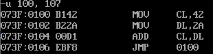
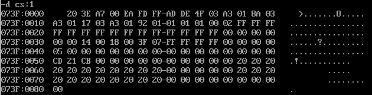
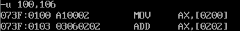

# Practical 1: Machine Execution

## Part I

1. How to open the debug program?

   ```assembly
   Open DOSBox,
   mount [driveLetter]: path\to\8086\
   
   Type `debug`
   ```

2. Which DEBUG command performs the following operations?  (Note: `-?`  for a list of commands)

     1. Display the contents of registers after the execution.
        1. `-r`
     2. Begin assembling statements that will be converted to machine language.
          1. `-a`
     3. Display machine code for assembly instructions entered
          1. `-D`
     4. Enter machine instructions into memory
          1. `-e` 

     - To display the content of all the register
          - `-r [register] [data]`
     - To quit the DEBUG session.
          - `-q`

  3. Use DEBUG to enter the following commands:

     ```assembly
     a 100
     mov cl, 42
     mov dl,2a
     add cl,dl
     jmp 100
     ```

     What you can see when the following command is typed?

     1. `u 100,107`
        1. All the machine instructions stored inside the code segment of the program, from the instruction pointer offset 100 to offset 107.
        2. 
     2. `d cs:100`
        1. The contents of the memory in the code segment (CS) from the offset 100 until the next 128th byte. (1 byte = 8 bits = 2 hex characters). 128 bytes output seems to be the default behavior for `-d` unless an alternative size is specified.
        2. 
     3. `e cs:100 a1 00 02 03 06 02 02`
        1. Nothing shown. `-e` is used to enter data/instruction (as machine code) directly into memory locations.
     4. `u 100,106`
        1. 
        2. The machine instructions stored in CS `073F`, between IP offset `0100` and `106` bytes are displayed.

4. What you can see when the following command is typed?

   1. `abc0 0fff`
      1. A user input request. Seems to be same as `a bc0`.
   2.  `0000 1111`
      1. Error. Did I got it wrong?

5. Use DEBUG to enter the following commands:

     1. ```assembly
          a 100 ; jumps to IP offset 100
          
          ; from this point onwards is just storing code
          
          mov ax,0123 ; ax = 0123
          add ax,0025 ; ax = ax + 0025
          mov bx,ax ; bx = ax
          add bx,ax ; bx = bx + ax
          mov cx,bx ; cx = bx
          sub cx,ax ; cx = cx - ax
     sub ax,ax ; ax = ax - ax
          jmp 100   ; shifts the IP back to 100, loop
          ```
          
     2. What you can see when the following command is typed?

          1. `-r`
             1. No much change for now?
          2. `-t` (repeat 7 times) (Note: every line corresponds to running `t` once. Only major changes are recorded, unrecorded details are the same as previous, or are just details for another major changes)
             1. `AX=0123`, `IP` advances
             2. `AX=0148`
             3. `BX=0148`
             4. `BX=0290`
             5. `CX=0290`
             6. `CX=0148`
             7. `AX=0000`
             8. Then basically infinite loop, because `jmp 100`
          3. What is the command to run 7 lines starting from the address 100?
             1. `-t 7`

6. Use DEBUG to enter the following command:
      `E CS:100 B8 45 01 05 25 00`

      1. The hexadecimal value 45 was supposed to be 54. Code another E command to correct only the one byte that is incorrect, that is change 45 to 54 directly.  
            1. `E CS:101 54`

7. Assume that you have used DEBUG to enter the following E command: `E CS:100 B8 05 1B 00 2C EB F8`

     1. What are the three symbolic instruction represented here?
          1. `B8 05 1B` = `MOV AX, 1B05`
          2. `00 2C` = `ADD [SI], CH`
          3. `EB F8` = `JMP 00FF`

## Part II

Well, totally didn't expect Part I to be so difficult. DOSBox is extremely limiting. Anyways, here we go again.

1.  Consider the machine language instructions

    `B0 1C D0 E0 B3 12 F6 E3 EB F6`
    Which instruction performs the following operations?  

   1. Move hex value 1C to the AL register. 
      1. `B0 1C`
   2. Shift the contents of AL one bit to the left.
      1. `D0 E0`
   3. Move the hex value 12 to BL. 
      1. `B3 12`
   4. Multiply AL by BL. 
      1. `F6 E3`
   5. Jump back to 100
      1. `EB F6`  
   6.  Use DEBUG’s `E` command to enter the program beginning at CS:100, then trace through the program until reaching JMP. What is the final product in AX? Confirm the result by manual calculation.  
      1. `AX=03F0`
      2. Manual calculation
         1. `AX=001C`
         2. `AX=0038` (Note: you cannot shift directly to `01C0`, you must first change to binary, shift it, then translate back to hex)
         3. `BX=0012`
         4. `AX=0038*0012=03F0`

2. 50

3. 141, 0

4. 800, 3

5. Answer

   1. AL becomes 10100000, bit-by-bit AND
   2. AL becomes FA or 11111010 (Extra note: BL also is the same, looks like the operators do not affect BL)
   3. AL becomes 5A or 0101 0000
   4. AL becomes 55 or 0101 0101

6. Answer

   | AX   | BX                                             |
   | ---- | ---------------------------------------------- |
   | 0008 | 00F0                                           |
   | 0004 | 00F0                                           |
   | 0004 | 0008                                           |
   | 0004 | 0010 (Note: 0000 1000 -> 0001 0000= 10 in hex) |


## Part III

1. | AX   | BX   | CX           | DX   |
   | ---- | ---- | ------------ | ---- |
   | 10   | 0    | 0            | 0    |
   | 10   | 20   | 0            | 0    |
   | 10   | 20   | 30           | 0    |
   | 30   | 20   | 30           | 0    |
   | 30   | 21   | 30           | 0    |
   | 30   | 21   | 0            | 0    |
   | 30   | 21   | FFFF (or -1) | 0    |

2. |       | AX   | BX   | CX   | DX   |
   | ----- | ---- | ---- | ---- | ---- |
   | LOOPS | 1    | 1    | 5    | 0    |
   | 1     | 1    | 2    | 4    | 2    |
   | 2     | 2    | 3    | 3    | 3    |
   | 3     | 3    | 5    | 2    | 5    |
   | 4     | 5    | 8    | 1    | 8    |
   | 5     | 8    | D    | 1    | D    |

3. | AX   | BX   | CX   |
   | ---- | ---- | ---- |
   | 10   | 0    | 0    |
   | 10   | 20   | 0    |
   | 10   | 20   | 30   |
   | 30   | 20   | 30   |
   | 30   | 21   | 30   |
   | 30   | 21   | 0    |
   | 30   | 21   | FF   |

4. 


