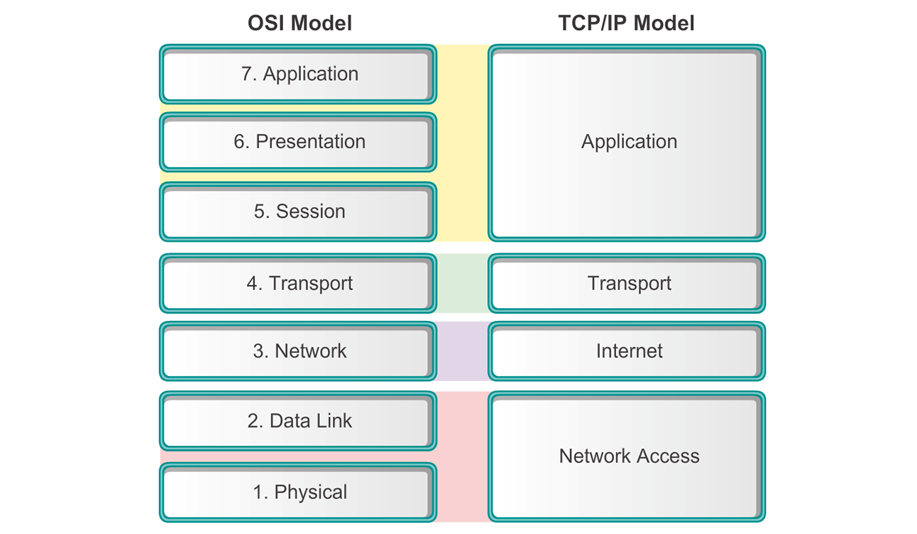

# FN: Tips for Mid Term

- C1-5, Schedule: Release by this week
  - Some will come 8-9
  - Some come 9-10
- :star: means high importance, double-stressed by lecturer
- :star: :star: means confirm come out
- :heavy_plus_sign: means optional, not mentioned by lecturer, just a gut feeling
- :grey_question: means its unclear, lecturer mentioned, but there's no good information in lecture notes/Netacad. Using google as source

## Table of contents

- [FN: Tips for Mid Term](#fn-tips-for-mid-term)
  - [Table of contents](#table-of-contents)
- [Notes](#notes)
  - [C1](#c1)
    - [Components of a network (Slide)](#components-of-a-network-slide)
      - [Network media (important, whole slide)](#network-media-important-whole-slide)
    - [Network Representation (OPTIONAL) :heavy_plus_sign:](#network-representation-optional-heavyplussign)
    - [Types of network](#types-of-network)
    - [The difference between intranet, internet, extranet :star:](#the-difference-between-intranet-internet-extranet-star)
    - [Cloud computing :star:](#cloud-computing-star)
      - [Benefits & Advantages (Explain each)](#benefits--advantages-explain-each)
  - [C2](#c2)
    - [3 elements of comms](#3-elements-of-comms)
    - [3 COMPONENTS of comms :grey_question:](#3-components-of-comms-greyquestion)
    - [Segmentation](#segmentation)
    - [Network Protocols :heavy_plus_sign:](#network-protocols-heavyplussign)
    - [**ISO** 7 layer :star: :star:](#iso-7-layer-star-star)
      - [Functions :star:](#functions-star)
      - [Know PDU name](#know-pdu-name)
      - [Benefits of layered model](#benefits-of-layered-model)
      - [Protocol & reference model](#protocol--reference-model)
      - [Mapping between OSI & TCP/IP](#mapping-between-osi--tcpip)
    - [Difference between encapsulation & decapsulation :star:](#difference-between-encapsulation--decapsulation-star)
  - [C3](#c3)
    - [Physical layer protocol](#physical-layer-protocol)
    - [Types of UTP Cable](#types-of-utp-cable)
    - [Fiber optic cabling](#fiber-optic-cabling)
    - [Bandwidth vs Throughput](#bandwidth-vs-throughput)
  - [C4](#c4)
    - [Trailer of frame :star:](#trailer-of-frame-star)
    - [Half & Full Duplex Difference](#half--full-duplex-difference)
    - [Physical vs Logical Topology](#physical-vs-logical-topology)
      - [Logical Topologies Types :heavy_plus_sign:](#logical-topologies-types-heavyplussign)
    - [Contention vs Controlled based access](#contention-vs-controlled-based-access)
  - [C5](#c5)
    - [LLC & MAC, read ALL](#llc--mac-read-all)
      - [Data Link Layer](#data-link-layer)
    - [Data encapsulation :star:](#data-encapsulation-star)
    - [Unicast address :star:](#unicast-address-star)
    - [IP address vs MAC address :star:](#ip-address-vs-mac-address-star)
    - [ARP Purpose, protocols, all ARP Process, refers to tutorial question.:star: :star:](#arp-purpose-protocols-all-arp-process-refers-to-tutorial-questionstar-star)

# Notes

## C1

### Components of a network (Slide)

- Explain 3 components of network components :star:
  - **Devices**: 
    - **End devices**: AKA hosts, form interface with human & communication network. 
    - **Intermediary devices**, carry data to destination.
  - **Media:** Pathway for data to transmit
    - Accepts specific encoding
  - **Services:** Network application, **provide information upon request**. Use communication program on network devices. **Processes** provide **back-end** for services.
- Services examples NOT important 

#### Network media (important, whole slide)

- Know examples
- Know encoding
- What type of media

| Media       | Example              | Encoding              |
| ----------- | -------------------- | --------------------- |
| Copper      | Twisted pair cable   | Electrical impulses   |
| Fiber-optic | Glass/plastic fibers | Light pulses          |
| Wireless    | 4G                   | Electromagnetic waves |

### Network Representation (OPTIONAL) :heavy_plus_sign:

- Not mentioned, but feel like good to know just in case.
- **NIC (Network interface card)**: Physical connection between host & network
- **Physical port:** Connector, allow communication between networking devices/hosts.
- **Interface:** Ports on intermediary devices, connect networking devices.

### Types of network

- Definitions of network infrastructure (may ask to COMPARE)
  - **LAN**: Network in **small geographical area**. Interconnects end-devices.
  - **WAN**: Network in **wide geographical area**. Interconnects LAN.
- **MAN (Metropolitan AN):** Larger than LAN, smaller than WAN. Operated by one organization.
- **WLAN (Wireless LAN):** Network in **small geographical area**. Interconnects end-devices *wirelessly*.
- **SAN (Storage AN)**: Network infrastructure, supports file servers, provide data storage, access, duplication. Interconnects servers, disk arrays (blocks). Use Fiber Channel (FC) to interconnect.

### The difference between intranet, internet, extranet :star:

- Define **Internet** :star:
  - Worldwide collection of interconnected devices.
- **Intranet**: Private connection of LAN/WANs. In organization.
- **Extranet**: Provide secure & safe access of data to third-party. To organization clients.

### Cloud computing :star:

#### Benefits & Advantages (Explain each)

- **Disaster recovery**: Data stored off-site, damage to site does not interrupt service.
- **Flexible & fast deployment**: *Instantly* scalable, can add services & capacity on demand. 
- **Reduce infrastructure cost**: Equipment acquisition & depreciation not a problem
- **New business models**: Eliminates physical distance, allow new strategies.
- **Security:** Reduces physical security threat such as theft & robbery.

## C2

### 3 elements of comms

- **Source**: Message **sender**, people/devices sending messages
- **Destination**: Message **receiver**, receives & interprets.
- **Channel**: Media provide pathway for message transfer

### 3 COMPONENTS of comms :grey_question:

- **Sender**: Sender of message
- **Message**: The information to be delivered
- **Receiver**: The recipient of message

### Segmentation

- Divide data into smaller parts called **segments**
- Benefits :star:
- **Multiplexing**: Allow multiple communications at one time through **interleaving**
  - Increase **reliability**
  - Increase **efficiency**: Supports sending through different routes

### Network Protocols :heavy_plus_sign: 

- **Protocol:** Formal set of rules, regulate communication between devices
- **Protocol suite:** Group of interrelated protocols for communication

### **ISO** 7 layer :star: :star:

- **A**ll **P**eople **S**eem **T**o **N**eed **D**ata **P**rocessing

#### Functions :star:

- `A`: Supports process-to-process communications (HTML, E-mail)
- `P`: Ensure information readable by `A`, translation & encryption (JPEG, MPEG)
- `S`: Start, monitor & stop sessions. Synchronize dialog. (SQL, RPC (Remote procedure call))
- `T`: End-to-end connection & reliability. Flow control. (TCP, UDP) 
- `N`: Path determination & logical addressing (IP) (Protocols: IP, Devices: L3 Switch & Routers)
- `D`: Physical addressing (MAC & LLC), how physical link used. (Protocols: Ethernet, PPP. Devices: Switches)
- `P`: Define electrical, mechanical, operational (EMO) specifications for physical link. Transfers raw bits. (Repeaters, hubs)

#### Know PDU name

- Some will get protocol in layers (each of the layer)
  - Especially layer 4 and 5
  - 2 examples in layer 2, 3
- `A-S:` Data
- `T`: Segments
- `N`: Packets
- `D`: Frames
- `P`: Bits

#### Benefits of layered model

- Look at the marks given, if 6 marks, give 3 points + 3 explanation
- Otherwise give all 4

| Benefit                              | Explanation                                        |
| ------------------------------------ | -------------------------------------------------- |
| Assists in protocol design           | Defined interface to layers above & below          |
| Fosters competition                  | Products from different vendor work together       |
| Prevents feature cross-contamination | Prevents technology in one layer affecting another |
| Provides common language             | Easy to describe networking functions & features   |

#### Protocol & reference model

- Difference

| Protocol model                                               | Difference                       | Reference model                                     |
| ------------------------------------------------------------ | -------------------------------- | --------------------------------------------------- |
| Model, closely matches structure of protocol suite.          | **Description**                  | Common reference to maintain consistency            |
| Represents all functionality for interface between human and network | **Purpose**                      | Aid in clearer understanding on process & functions |
| Intended to be                                               | **Implementation specification** | NOT intended to be. Not detailed enough             |
| TCP/IP                                                       | **Example**                      | OSI                                                 |

#### Mapping between OSI & TCP/IP

- "Fill in the blanks" type of question
- **Armadillos Take in New Ants**

### Difference between encapsulation & decapsulation :star:

- **Encapsulation:** Process to add networking headers & trailers to data for transmission
- **Decapsulation:** Opposite of encapsulation

| Encapsulation   | Differences      | Decapsulation     |
| --------------- | ---------------- | ----------------- |
| Increases       | Content          | Decreases         |
| Down            | Direction in OSI | Up                |
| Source computer | Occurrence       | Receiver computer |

## C3

### Physical layer protocol

| Media             | Signals (Patterns of..) |
| ----------------- | ----------------------- |
| Copper cable      | Electrical pulses       |
| Fiber-optic cable | Light                   |
| Wireless          | Microwaves              |

### Types of UTP Cable

| Type of cable              | When to use                                                  |
| -------------------------- | ------------------------------------------------------------ |
| Straight-through           | Different category of devices (Eg: end-devices to intermediary) |
| Crossover                  | Same category of devices (Eg: intermediary to intermediary)  |
| Rollover :heavy_plus_sign: | Connect to console port                                      |

### Fiber optic cabling

- **Explanation**: An assembly similar to an [electrical cable](https://en.wikipedia.org/wiki/Electrical_cable), but containing one or more [optical fibers](https://en.wikipedia.org/wiki/Optical_fiber) that are used to carry light
- Advantages of fiber optic
  - Lower latency
  - Higher bandwidth supported
  - Higher maximum supported distance
  - Immune to EMI & RFI
  - Immune to electrical hazards

### Bandwidth vs Throughput

| Bandwidth                                      | Differences | Throughput                                                   |
| ---------------------------------------------- | ----------- | ------------------------------------------------------------ |
| Capacity of medium to carry data               | Definition  | Measure of bits transferred through media over certain time  |
| Maximum limit                                  | Capacity    | Usually lower than bandwidth. Cannot be faster than slowest link. |
| Properties of media. Technology for signaling. | Factors     | Amount, type, latency of traffic.                            |

## C4

### Trailer of frame :star:

- Similar to tutorial question in T4 & T5

  - Based on Figure 1, identify a frame trailer that had indicated as “B”. List a role of that flag.
    - “B” refers to Error Detection fields or Frame check sequence (FCS). The field is used for error checking

| **7  bytes** | **1 byte**         | **6  bytes** | **6  bytes** | **2  bytes** | **46-1500**  **bytes** | **4  bytes**     |
| ------------ | ------------------ | ------------ | ------------ | ------------ | ---------------------- | ---------------- |
| Preamble     | Frame Delim. start | Dest. Addr   | Src. Addr    | Length       | 802.2 Header & Data    | Frame Check Seq. |

- For above, remember just the last part
- Explanation of trailer parts, functions
- **Error Detection Fields / Frame Check Sequence (FCS)**. Used for error checking
  - **Stop frame.** Used to signify end of the frame
- **CRC (Cyclic Redundancy Check)**, function of it

  - Computes checksum used for error checking. Receiver recalculates the checksum and verify it matches the given CRC checksum.

### Half & Full Duplex Difference

| Half-duplex            | Differences          | Full duplex    |
| ---------------------- | -------------------- | -------------- |
| Send/receive, not both | Transmission         | Simultaneously |
| Hub                    | Intermediary devices | Switch         |

### Physical vs Logical Topology

| Physical T                                                   | Differences | Logical T                            |
| ------------------------------------------------------------ | ----------- | ------------------------------------ |
| Physical connections                                         | Refers to   | The way a network transfer frames    |
| Identifies how devices are interconnected                    | Function    | Controls network communication       |
| **LAN**: Star, Extended Star, Bus, Ring topology. **WAN:** Point-to-point, Hub-and-spoke, Full mesh | Examples    | Contention-based & controlled access |

#### Logical Topologies Types  :heavy_plus_sign:

- **Multi-access**: Multiple possible destination, MAC address required
- **Point-to-point**: 1 possible destination, MAC address not required

### Contention vs Controlled based access

| Contention-based                   | Differences | Controlled-base                             |
| ---------------------------------- | ----------- | ------------------------------------------- |
| Everyone send when ready           | Operation   | Wait for turn to send                       |
| Transmit anytime                   | Access      | One station at one time, must wait for turn |
| Collision exist, use CSMA/CD or CA | Collisions  | Collisions do not exist                     |
| 802.3 Ethernet                     | Examples    | Token Ring, Polling                         |

- CSMA: Carrier-sense multiple access

## C5

### LLC & MAC, read ALL

#### Data Link Layer

| LLC                                                          | Difference     | MAC                      |
| ------------------------------------------------------------ | -------------- | ------------------------ |
| Upper layer of DLL                                           | Location       | Lower layer of DLL       |
| Handles comm. between upper and lower layer. Add control information to PDU. | Functions      | Data encapsulation & MAC |
| Software-side                                                | Implementation | Hardware-side            |
| Driver of NIC                                                | Similar to     | NIC                      |

### Data encapsulation :star:

- **Frame delimiting:** Identify group of bits making up a frame. Sync sender & receiver.
- **Addressing:** Add MAC address to Ethernet header for delivery.
- **Error detection: **Add CRC trailer to Ethernet frame for error detection.

### Unicast address :star:

- Ask to guess address, unicast, multicast, or broadcast
- Ask source **IP** & destination **IP** address
- Ask source **frame** and destination **frame**, copy down MAC address (DONT WRITE IP)
- What is this diagram, unicast, broadcast, or multicast.
  - If destination map is 1 device, then unicast
  - If destination map is all F, then broadcast
  - If destination IP start with 224, then multicast

### IP address vs MAC address :star:

| MAC                        | Address     | IP                           |
| -------------------------- | ----------- | ---------------------------- |
| Don't change               | Mutability  | Change depending on location |
| Names                      | Similar to  | House addresses              |
| Physical address           | AKA         | Logical address              |
| Host NIC                   | Assigned by | Network Admin                |
| Layer 2 devices (Switches) | Examined by | Layer 3 devices (Routers)    |

### ARP Purpose, protocols, all ARP Process, refers to tutorial question.:star: :star: 

- **Purpose:** Find MAC address of destination in Ethernet
- **Functions:** Resolve IPv4 to MAC address, maintain table of mapping.
- **Protocols:** ARP
- **Process (PC):**
  - Check if ARP entry present
  - If not present
    - Broadcast ARP request with IP
    - Receiver with same IP reply with MAC address
    - Host add IP & MAC pair to ARP cache
  - If present
    - Send data directly to destination
  - If (still) not present
    - Drop packet, alert sender host not found
- **Process (Switch)**:
  - One PC sends a broadcast frame to switch
  - The switch saves sender MAC address & switch port pair into address table
  - Switch floods frame to all ports, except sender's port
  - Receiver device replies with unicast address to PC1
  - Switch saves receiver MAC & switch port pair
  - Switch free to forward frames without flooding because have entries
- (Tutorial) What happens when you have a frame when you cannot find the destination
- Refer to your tutorial question Tutorial 5 (c)
  - If cant find destination, then IP will broadcast to all except incoming address
  - Sometimes PC will change (scenario will change)
  - **Complete answer**: The MAC address is not present in the MAC table of the switch. Because the switch does not know where to send the frame that is addressed to PC4, it will forward the frame to all the switch ports, except for port 4, which is the incoming port.
