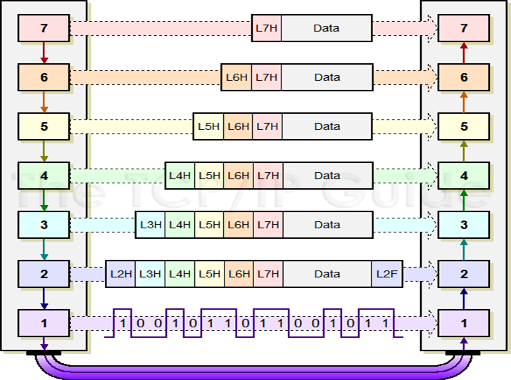
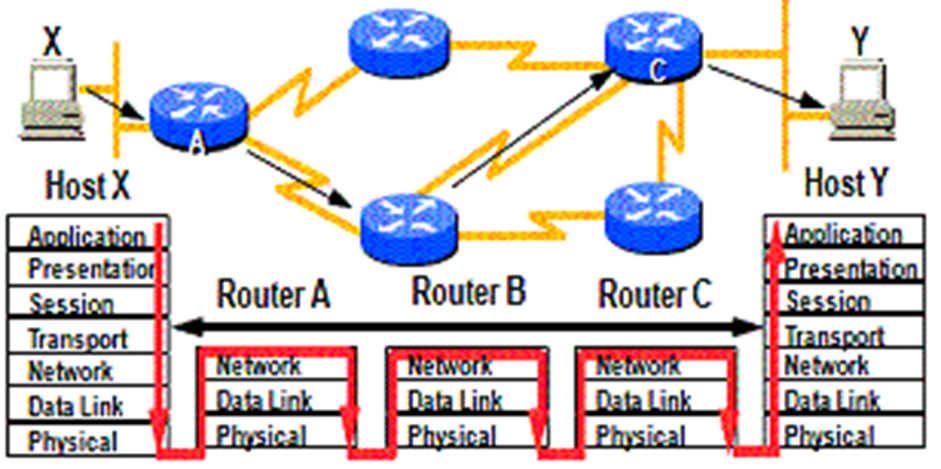
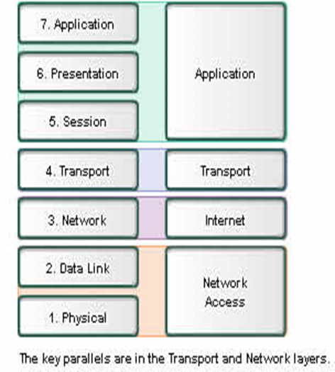
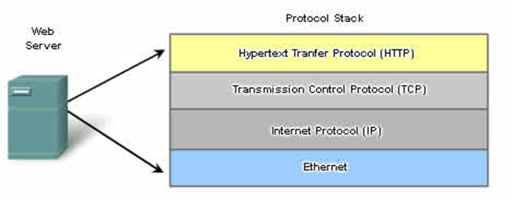
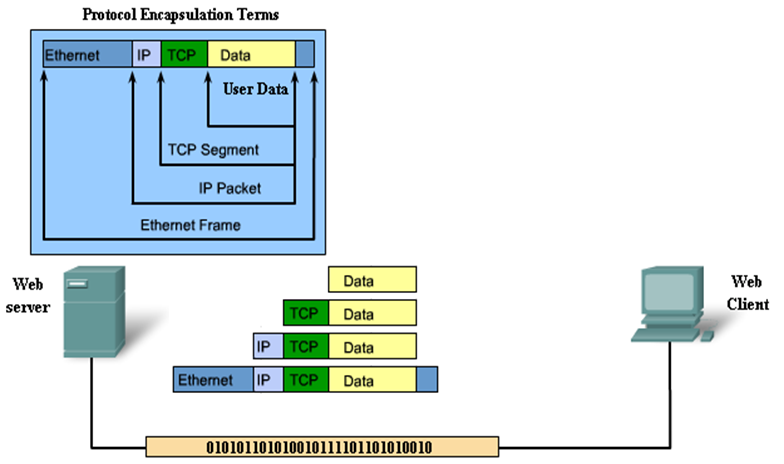

# FN C2: Net. Pro. & Comms.

## 2.1 Rules of communication

- Elements of communication

  - Communication begins with message + recipient + method.
  - Common elements:
    - Source/Sender: People/devices sending message
    - Destination/Receiver: Receiver & interpreter of message
    - Channel: Media provide pathway for message transfer
  - Note:
    - Source must pair with Destination
    - Sender must pair with Receiver

### Communicating message

- **Segmentation:** Divide data into smaller pieces
  - Allow **multiplexing:** 
    - Interleaving pieces of separate conversation to share bandwidth
  - Increase reliability
  - Increase efficiency: Multiple routes

## 2.2 Network Protocols & Standards

### Network Protocols

- **Protocol**: Formal description of rules & conventions controlling  communication method of devices in network.
- **Protocol suite:** Group of inter-related protocols necessary for communication function.

### OSI Model

- Mnemonic
  - All people seem to need data processing

#### Benefits of Layered Model

- Defined interface to layers above and below
- Products from different vendors can work together
- Prevents capability in one layer affecting the other
- Provides common language to describe capabilities.

#### Protocol & Reference Model

- Protocol model
  - Model closely match particular protocol suite.
  - Represent all functionality to interface human network with data network
  - Ex: TCP/IP Model
- Reference model
  - Common reference 
  - Maintain consistency with other network protocols and services
  - Not intended to be implementation specification
  - Not enough details, only to aid clearer understanding

### OSI Model Reference

- Note: Top-down, from Layer 7 to 1.

| No   | Layer        | Description                                                  | Examples                                                     |
| ---- | ------------ | ------------------------------------------------------------ | ------------------------------------------------------------ |
| 7    | Application  | **User interface**                                           | E-mail, HTTP                                                 |
| 6    | Presentation | **Data representation**, encryption, decryption              | JPEG, MPEG                                                   |
| 5    | Session      | 1. Start, **monitor**, terminate **connection session**      | SQL, RPC, NETBIOS                                            |
| 4    | Transport    | **Flow control** & retransmission                            | TCP, UDP                                                     |
| 3    | Network      | 1. Source & destination **logical/IP addressing** 2. Best path determination | 1. Protocols: IP 2. Devices: Layer 3 switch & routers   |
| 2    | Data Link    | **Physical addressing (MAC)**, network topology, access, error notification 2. Layers:  2.1: User Layer: Logical Link Control (LLC) 2.2: Media Access Control (MAC) | 2. Protocols: Ethernet, Token Ring Bridges, switches, NIC |
| 1    | Physical     | **Encode & transmit raw data bits** - Electric & radio signals - Remember EMO (Electrical Mechanical Operational) | Repeaters, hubs                                              |

- Note: Lecture notes problem, in given text Ethernet is in Layer 2, in table is in Layer 1

### Encapsulation and Decapsulation

**Encapsulation:** Process which networking headers & trailers are added to data for transmission.

**Decapsulation:** Reverse of encapsulation

#### Dynamic Routing

#### TCP/IP vs OSI

### TCP/IP Protocols

| Protocol       | Example         | Definition                                                   |
| -------------- | --------------- | ------------------------------------------------------------ |
| Application    | HTTP/DNS        | Content & formatting                                         |
| Transport      | TCP/UDP         | Divides data into segments. Control rate & size              |
| Internet       | IP (IPv4, IPv6) | Encapsulate segments into packets. Assign addresses. Best path determination. |
| Network Access | Ethernet        | Data link management. Physical data transmission             |

#### Transmission Process

- Note: Receiving process is just tear down layer-by-later

#### Advantages of IP packets

- **Media independence**: Packets travel over different media

