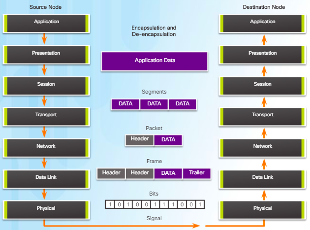

# C3: Network Access

## 4.1 Physical Layer Protocols

### 4.1.1.1 Connecting to Network

- A physical connection to a local network is required for network communications.
- Can be wired or wireless
- Wireless degrade overtime, range extender mitigates it.

### NIC

- Network interface cards: Connects devices to internet
- Can be wired, wireless, or both.

### 4.1.2.1 Physical Layer Protocol

- OSI physical layer provides a way to transport bits making up data link layer.
- Physical layer accepts complete frame from data link layer & encode as signals.
- Process:
  - Transport Layer: User data :arrow_right: segments
  - Network Layer: Segments :arrow_right: packets
  - Data Link Layer: Packets :arrow_right: Frames
  - Physical Layer: Frames :arrow_right: Bits :arrow_right: Signals
  - Destination Physical Layer:  Signals :fast_forward: Bits, pass to Data Link Layer

### 4.1.2.2 Physical Layer Media

- Basic form of network media

| Media             | Signals (Patterns of..) |
| ----------------- | ----------------------- |
| Copper cable      | Electrical pulses       |
| Fiber-optic cable | Light                   |
| Wireless          | Microwaves              |

### 4.1.2.3 Physical Layer Standards

- IETF :hammer_and_wrench: TCP/IP
- International physical layer standards
  - ISO (International organization for standardization)
  - ANSI (American National Standards Institute)
  - IEEE (Institute of Electrical and Electronics Engineers)
- Regional physical layer standards
  - JSA (Japanese Standards Association)

### 4.1.3.1 Functions

- **Physical components**: Electronic hardware devices, media, connectors, that transmit and carry signal representing bits.
- **Encoding:** Convert data bits into predefined, recognizable code.
  - **Manchester Encoding:**
    - High-to-low: 0 bit
    - Low-to-high: 1 bit
    - Done during MIDDLE of bit transition
- **Signaling**: Method to represent bits

| Media                 | Phys. Comp.                                                  | Encoding                                                     | Signaling                                                    |
| --------------------- | ------------------------------------------------------------ | ------------------------------------------------------------ | ------------------------------------------------------------ |
| **Copper cable**      | •Coaxial   •NICs   •Ports                          | •Manchester Encoding  •Non-Return to Zero (NRZ) techniques   •4B/5B  •8B/10B | •Changes in the EMF •Intensity of EMF• Phase of EMF |
| **Fiber Optic cable** | •Single-mode Fiber •Multimode Fiber •NICs •Interfaces •Lasers and LEDs | •Pulses of light •Wavelength multiplexing (using colors) | • Pulse = 1 •No pulse = 0.                              |
| **Wireless media**    | •Access Points  •NICs •Radio  •Antennae                 | •DSSS (direct-sequence spread-spectrum) •OFDM (orthogonal frequency division  multiplexing) | •Radio waves                                                 |

### 4.1.3.2 Bandwidth

- **Definition:** Capacity of medium to carry data.
- **Factors:** Properties of media & technologies for signaling

### 4.1.3.3 Throughput

- **Definition**: Measure of bits transferred through media over certain time.
- Usually lower than bandwidth, due to amount, type, latency of traffic.
- Cannot be faster than slowest link. Max = BWidth - Overhead.

