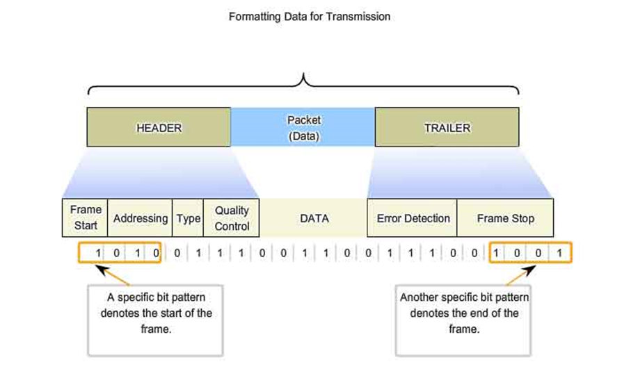
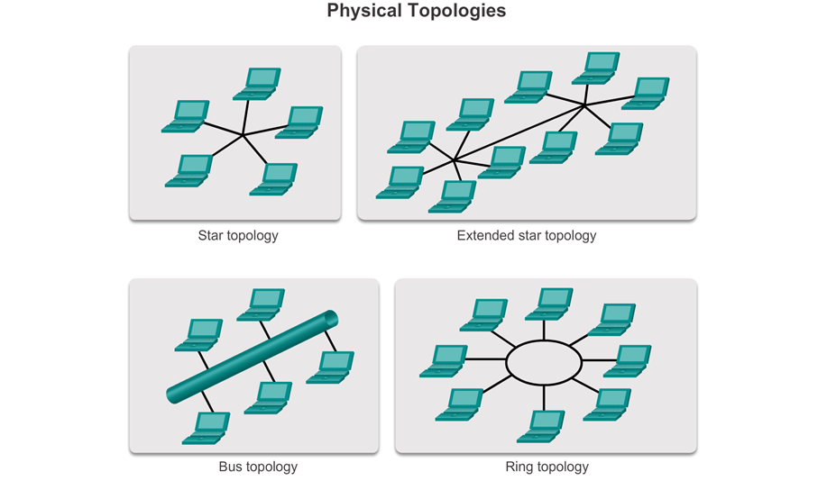
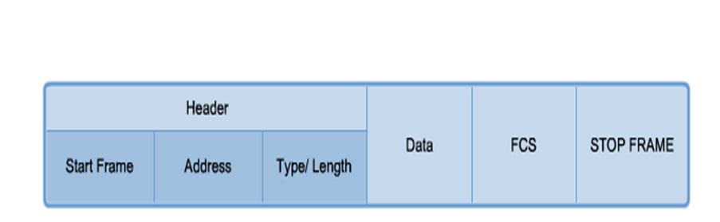
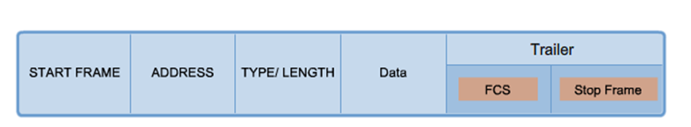
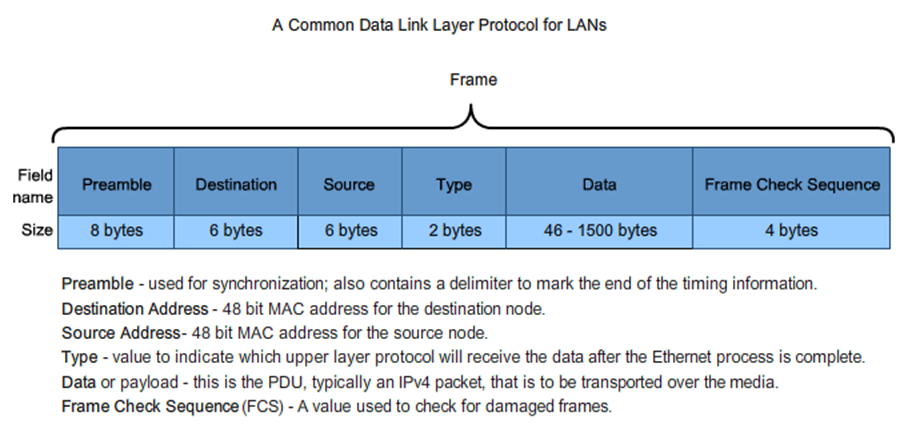
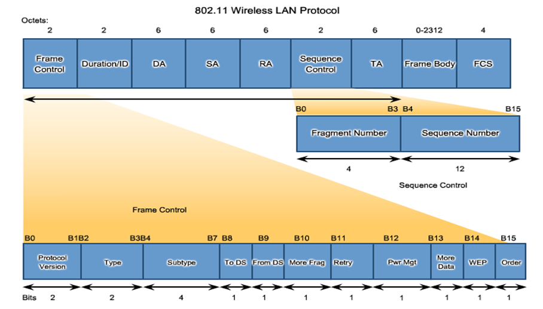

# C4 - Data Link Layer

## Data Link Sublayers

LLC Sublayer, MAC Sublayer

## 4.2 Media Access Control

- Data link layer protocols control frame formatting for each media
- Different protocol in different media
- At each hop, an intermediary device:
  - Accepts the frame
  - Decapsulates
  - Forward the packet in new frame, formatted for the specific medium crossing.

### Layer 2 Frame Structure

## WAN Topologies

- Point-to-point topology
  - Physical point-to-point topology (2 nodes)
  - Logical point-to-point topology
- Hub and spoke topology
- Full mesh topology

#### Half & Full Duplex CLARIFY

- Half Duplex: Send/Receive only
  - 1 pair of wire
  - Network hubs :arrow_right: prevent collision
- Full Duplex: Send and receive
  - Use 2 pair of wires
  - Switch

#### Physical LAN Topology

### Logical Topology for Shared Media

- **Contention-based access**: Everyone attempts to send when ready.
  - Transmit anytime
  - Collision exists, uses CSMA/CD or CSMA/CA to resolve
  - Examples: 802.3 Ethernet, 802.11 wireless
- **Controlled access:** Everyone waits for their turn to send.
  - One station one time, must wait for turn
  - No collisions, may use tokens
  - Examples: Token Ring, FDDI

## Data Link Frame

### The Frame

- In a fragile environment, more controls are needed. Header and trailer are larger.
- In protected environment, fewer controls. Smaller fields & smaller frames.

### The Header

### Layer 2 Address

- Logical Multi-Access Topology
  - Frame has many possible destinations
  - Data Link layer addresses required
- Logical Point-to-Point Topology
  - Has 1 possible destination
  - Data link layer address not required

### The Trailer

### Ethernet Frame

### Point-to-Point Protocol Frame

### 802.11 Wireless Frame

