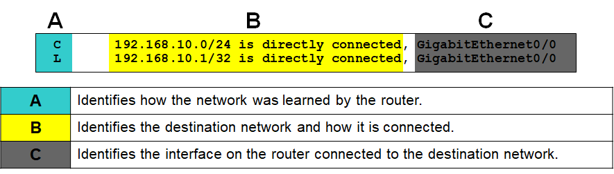
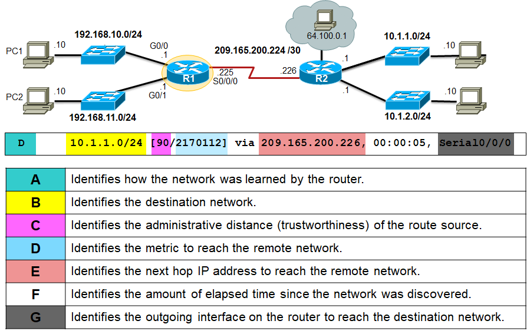
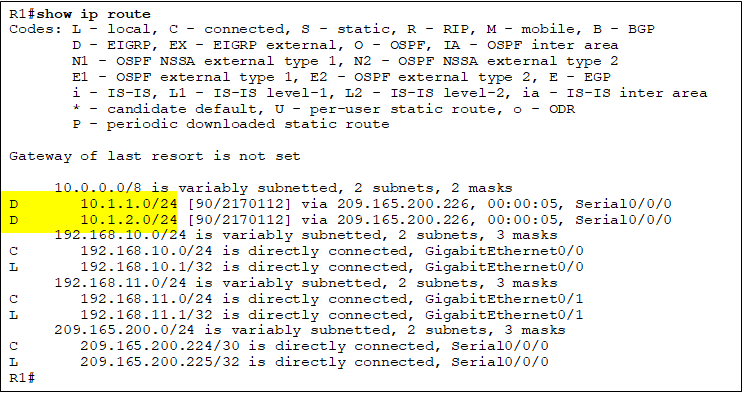
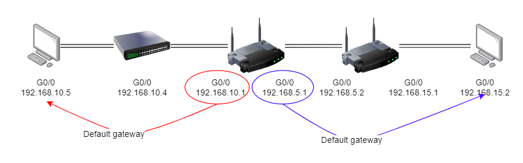

# C6: Network Layer :globe_with_meridians:

### Final Exam :memo:

- "Directly Connected Routing Table Entries"

## Objectives :o:

- Explain how network layer protocols & services support communications
- Explain how routers enable connectivity
- Determine appropriate device to route traffic
- Configure router

## 6.1 Network Layer Protocols :mailbox:

- Network = 3rd layer of OSI model
  - Path Determination
  - IP (Logical Addressing)

### Network layer (Host-to-Host communication)

- **Addresses** packets with IP Address. :e-mail:
- **Encapsulate** packets :pill:
- **Routes** packets​ :mountain_cableway:
- **Decapsulates** packets :open_file_folder:

### IP

- Internet Protocol
  - Common: IPv4 & IPv6
  - Only **Layer 3 protocol** used in **Internet**
- **Focus**, of course

## Characteristics of IP

- **Connectionless**: No connection before sending data
  - Sender:
    - don't know if receiver is there
    - arrival status
    - readability
  - Receiver:
    - don't know arrival time
- **Best effort** (unreliable): No overhead to guarantee delivery
  - No capability to manage & recover problematic packets
  - Other layer manage reliability
- **Media independent**: Operates independently of medium
  - Concerned with size of packet or MTU (max transmission unit)
  - MTU, communication between Data Link & Network layer
  - **Fragmentation:** Router split up packets with smaller MTU than limit.
- **Packaging Transport Layer PDU**
  - Segment Header + Data
- **Features of IP** packet header
  - Version 
  - Header checksum: Reconstruction of fragments 
  - Type of Service: Throughput priority (8 bits)
  - **Time To Live (TTL)**: Max "hops" before drop
  - **Source IP Address**: 32-bit
  - **Destination IP Address**: 32-bit

### Limitations of IPv4

- **IP Address Depletion**. Limited number of unique public IP address. :card_file_box:
- **Routing table expansion**. IPv4 has more nodes, many are badly configured, more overhead. :outbox_tray:
- **Lack of end-to-end connectivity**. IPv4 uses Network Address Translation (NAT) for multiple devices to share single public IP. As a result, end-to-end connectivity becomes problematic as the *device do not have its own public IP.*  :link:

### IPv6

- **Increased address space**. Much bigger public IP pool, enough for everyone.
- **Improve packet handling**. No IP-level checksum, more efficient transfer.
- **Eliminate need for NAT**. Restore end-to-end connectivity at IP layer.
- **Improved security**. IPSec, providing security, authentication, and integrity, is baked into IPv6.
- Header similarities with IPv4:
  - Version
  - Source & destination address

## 2. Routing - Host Routing Tables

### Host Packet Forwarding Decision

- IP address of router is default gateway (in most cases)

### Default Gateway

- **Definition**: The router used to forward all traffic that is not addressed to a station within the local network or local subnet. 

- Hosts must maintain own routing table
- Typical contents:
  - Direct connection
  - Local network route
  - Local default route

### Router Packet Forwarding Decision

- Directly connected network
  - within 1 hop
- Remote networks
  - More than 1 hop

### IPv4 Router Routing Table

- To display, use `netstat -r` 

### Directly connected routing table entries

- 
- For Part A:
  - `C`: Connected
  - `L`: Link local
- For part B:
  - For `C`: Refers to network connected
  - For `L`: Refers to the interface IP address
- For Part C:
  - Nothing special, just refers to ports

### Remote Network Routing Table Entries

- For Part A, B and G is similar to the local.
- For `D`: Lower values indicate faster routes

### Next-Hop Address

- On the image above `D`  refers to `EIGRP`  which is  Enhanced Interior Gateway Routing Protocol. It is a routing protocol that searches for the best route to destination.
- According to the image, the two highlighted points have a `via 209.165.200.226`. This is the interface of the next hop.

## 3. Routers

- Routers are computers

### Components - Memory

| Memory | Volatility   | Stores                                                       |
| ------ | ------------ | ------------------------------------------------------------ |
| RAM    | Volatile     | Running OS, config files, routing & ARP tables, packet buffer. |
| ROM    | Non-volatile | Bootup instructions, basic diagnostics, limited IOS          |
| NVRAM  | Non-volatile | Startup config files                                         |
| Flash  | Non-volatile | OS, System files                                             |

## OSI Model

- **PDU:** Packet Data Unit

## Communication from Host-to-Host

- **Network Layer**: Communication from one host to another.
- Only layer 3 protocol used in Internet.
- Final may ask to explain characteristics of IP
- **Routing: Very important topic**
- Potential final exam question
  - 
  - **Final exam** may ask similar question: 
    - will give you different IP, and explain what can you understand about the diagram and the table. 
    - **To answer**: Router R1 will have 2 networks, [list down the IP address], in order for router network A to route to network B, the packets need to pass through the default gateway [write default gateway IP here]. 
    - If you get all 0.0.0.0 for your IP, it is called *default IP address* (6.2 Routing Sample IPv4 Host Routing Table) 
  - **Note**: Default gateway need to point to the EXIT point of the network, not any other gateways.
    - 
  - That topology have 2 network, sometimes question might ask you to label
  - If say in network A: 192.168.10.1, then need to pass to default gateway (which is the center route)
  - Gateway check source & destination
  - Gateway points to 192.168.10.1
- `show ip route`: (During exam will have, show all the path)
  - `d` = dynamic routing protocol (1 hop away)
  - `c` = directly connected
  - `l` = local (all on same network all have IP)
- Administrative distance (or whatever that is) need to be memorized

