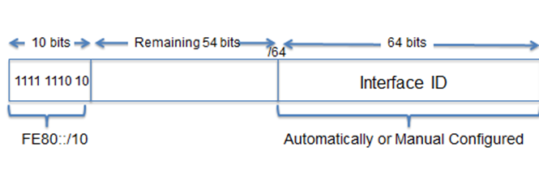

# C7: IP Addressing

## Final Exam/SPA

Bitwise AND operation

- IP give you subnet mask & IP address
- Convert into binary bits
- Break it into 8 bits
- Do the Bitwise AND operation to get the Network Address

Private address blocks

Special Use IPv4 Address

## 7.0 Introduction

- **Binary notation**: Communication using 1s and 0s.

## 7.1 IPv4 Network Addresses

### Network & Host Portion of IPv4 Address

- **Subnet mask:** 24+8 bit pattern

  - Tells network where to look

  - **Valid:** 
    $$
    2^{8-n} ,n\in\{0,1,2,...8\}
    $$

    - Reason: Mask is from front-to-back (like 255.0.0.0), not other way round (like 0.0.0.255).

### Examining Prefix Length

- Network address: `X.X.X.X/YY`
  - For `YY`, can be from `24`  to `32`. Highly related to subnet mask pattern above.
  - The larger your `YY` (AKA the more BS you get), the less your number of hosts available (AKA less people you can talk with)
  - In the most general case:
    - First host: Always X.X.X.0
    - Last host: Always X.X.X.254
    - Broadcast: Always X.X.X.255
    - Number of hosts: 2^32-YY^

### Assigning Dynamic IPv4 Address

- **DHCP** (Dynamic Host Configuration Protocol): "Lease" IPv4 address 
  - Eliminate entry errors
  - Reduce network support staff burden

### IPv4 Communication

- **Unicast:** one-to-one host
- **Broadcast:** one-to-all host
- **Multicast:** one-to-many host
  - Reduce traffic
  - Link local: `224.0.0.0 - 224.0.0.X`
  - Global scope: `224.0.1.0 - 238.X.X.X`

### Private & Public IPv4 Address

#### Private

- Internet not mandatory
- 3 blocks
  - 10.0.0.0/8
  - 172.16.0.0/12
  - 192.168.0.0/16

#### Shared address space

- Not globally routable
- Only in ISP
- 10.64.0.0/10

#### Special Use

- If they ask, I'd rather give up 2 marks then memorize 200++ specific stuff
- **Network & Broadcast Addresses**: First & last addresses
- **Loopback address:** 127.0.0.1 (adblocker)
- **Experimental**: 240.0.0.0 - END

### Types

#### Legacy Classful Addressing

- **Address class:** A-E
- **1st octet range:** 
  - A: 1-127, 
  - E: 240-255. 
  - The middle one figure out yourself (using below)
- **1st octet bits:** 
  - The more `E`  your address class, the more BS bit in front
    - A: **0**XXXXXXX
    - B: **10**XXXXXX
    - E: **1111**XXXX
- **Network (N) & Host (H) parts of address:**
  - A: '**N**.H.H.H'
    - Increase `N`  down the line
  - D & E: '**N.N.N.N**'
    - D: Multicast
    - E: Experimental
- **Default subnet mask (decimal & binary)**
  - A: **255**.0.0.0
  - Increase down the line
- **Number of networks**
  - Use your `first octet range` to decide

#### Classless Addressing

- **Classless Inter-Domain Routing (CIDR)**: New standard to allocate IPv4 address on any prefix length, don't need to follow classes.

### Assigning of IP Addresses

- Regional Internet Registries (RIRs) (remember ARIN enough)
- 3 tiers of ISP in internet backbone
  - Tier 1: Directly connected to internet backbone (**TM**)
  - Tier 2: Business Customers (**TM**, Maxis, TIME)
  - Tier 3: Serve regular customers (**TM**, Maxis, TIME)
- This is why TM monopoly, we stuck at bad speed so long until DAP come over.

## 7.2 IPv6 Network Addresses

- Successor of IPv4 due to depletion of IPv4 address space
- Larger address space + new enhancements

### Migration

- **Dual-stack**: Concurrent IPv4 & v6
- **Tunneling:** Encapsulate IPv6 packet into IPv4, send it over

- **Translation**: Translate from IPv4 to v6, and vice versa.

### Hex Number System

- Use your Computer Systems Architecture knowledge
- IPv6 address representation: 8 hextets (4 hex) = 32 hex
- **Rules:**
  - Can omit leading 0
  - Omit all 0 segments (ONLY ONCE)
    - Use `::`  to replace continuous all 0s.
    - Can only do once, more than once: `2001:0DB8::ABCD::1234` NOT ALLOWED.
- **IPV6 Prefix Length**: 0-128, typically /64
- Types of IPv6 address
  - Unicast
    - Send packet directly to interface with that address
    - Source MUST be unicast.
    - **Global Unicast**: Globally unique, internet routable address. Either dynamic or static.
      - Currently, only `2000::/3`  being assigned
      - Parts: 48-bits GRP + 16-bit subnet ID + 64-bit interface ID
        - **Global Routing Prefix (GRP)**: Indicate Prefix/Network portion
        - **Subnet ID**: Used for orgs to Identify subnets
        - **Interface ID:** Host portion of address, used because single host can have multiple interfaces.
    - **Link-local**: Communicate with other device on same local link
      - Single link only
      - AKA **subnet**
      - REQUIRED for all IPV6 interfaces
      - Range: `FE80::/10`, first 10 bits: `1111 1110 10XX XXXX` (FE80) - (FEBF)
      - 
    - **Loopback:** Send packet to itself, represented as ::1/128 or ::1
    - **Unspecified:** Used as source address temporarily until get permanent IPv6 address OR source not important.
      - Represented as `::/128` or `::1`
      - Cannot be assigned
    - **Unique local: ** Private addresses
      - Local addressing
      - Between `FC00::/7`  to `FDFF::/7`
    - **IPv4 embedded**: Transition from IPv4 to v6, not covered, ignore.
  - Multicast
  - ~~Broadcast~~ Anycast

### Dynamic Configuration of Global Unicast Address using SLAAC

#### SLAAC - Stateless Address Autoconfiguration

- Allow device to obtain:

  - prefix

  - prefix length

  - default gateway

    from IPv6 router without DHCPv6 server

- Relies on ICMPv6 RA (Router Advertisement) messages

#### IPv6 Routers

- Forwards IPv6 packets
- Uses static routes OR dynamic IPv6 routing protocol
- Send ICMPv6 RA messages

#### IPv6 Unicast Routing

- Enables IPv6 routing
- RA messages can be one of:
  - SLAAC only: Provide all information
  - SLAAC and DHCPv6: Partial information, get rest from DHCPv6 server (e.g. DNS)
  - DHCPv6 only: No information, get all from DHCPv6 server
- Send using link-local address

##### Steps

1. Router solicitation (request)
2. Router advertisement message (reply)

### Dynamic Configuration of Global Unicast Address using DHCPv6

- Similar to IPv4
- Auto receive partial/all info from DHCPv6 server depending on RA message
- Host can ignore RA, and get from DHCPv6

### Unicast Address Generation: EUI-64 & Randomly Generate

#### EUI-64 Process

1. Basically take client 48-bit MAC, split into 24/24.
2. Insert 16-bit: FFFE
3. Reverse 7th bit (Universally/Locally bit)
4. Advantage & Disadvantage: Easily traced

#### Randomly Generated Interface ID

1. Replace EUI-64 due to privacy issues

### Dynamic Link-local Address

- Autogenerate after obtain global unicast address
- Must have for communication in same subnet
- Used for DHCPv6 messages
- Used for hopping in router's routing table
- Pattern: FE00::/10 + Some blank space + /64 EUI-64/Random Number

##### Configuring Link-local

```bash
interface gigabitethernet 0/0
ipv6 address fe80::1 ?
ipv6 address fe80::1 link local
exit

// to show results
show ipv6 interface brief
```

#### Assigning IPv6 Multicast Address

- Have `FFXX::/8` prefix
- Two types:
  - **Assigned multicast**
    - Common groups:
      - `FF02::1`, All-nodes multicast group
        - All devices
        - Same as broadcast in IPv4
      - `FF02::2`, All routers multicast group
        - All IPV6 routers
        - Autojoin if `ipv6 unicast-routing`  enabled
        - Packet sent here is processed by all routers
  - **Solicited node multicast**
    - Last 24-bits same as all-nodes multicast
    - Created when link-local/global unicast address assigned
    - Combine `FF02:0:0:0:0:FF00::/104`, last 24-bits is prefix (104+24=128-bits)

### ICMPv4 & v6 Messages

- Common messages:
  - Host confirmation
  - Destination/service unreachable
  - Time exceeded
  - Route redirection
- IP not reliable, but TCP/IP send messages for certain errors using ICMP.
- New stuff (Neighbor Discovery Protocol, ND/NDP):
  - **Router/Neighbor Solicitation/Advertisement** message (RS, NS, RA, NA)
  - **RS & RA**: Between hosts & routers
  - **RS**: Sent to IPv6 all-routers multicast
  - **RA**: Sent by router for addressing information
  - **NS & NA:** 
    - Address resolution (for device to know MAC address)  
    - Duplicate Address Detection (DAD), send NS with own IPv6 as target.

### Traceroute - Path Testing

- `tracert` command
- Generate hops successfully reached
- If success, list all interfaces
- If fail, address of last hop provide troubleshooting information
- Also provide RTT (Round Trip Time) for each hop

## 7.3 Summary

- IP Address are hierarchical, can represent network, host, or broadcast address.
- Subnet mask OR prefix used to determine IP address portion.
- DHCP enable automatic assignment of addressing information.
- IPv4 communicate using uni/broad/multicast
- Private IPv4 blocks are 10.0.0.0/8, 172.16.0.0/12 and 192.168.0.0/16
- Depletion force IPv6
- IPv6 use uni/multi/anycast
- IPv6 link-local allows local network communication
- ICMP available on IPv4 and v6.