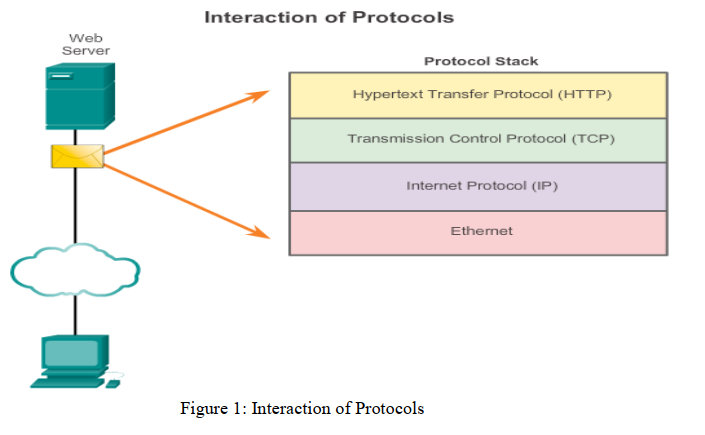
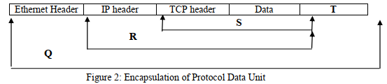

# Tutorial 2 : Network Protocols & Communications

## Question 1

### Part A

#### Question

  “Before communicating with one another, individuals must use established rules or agreements to govern the conversation.” Discuss this statement.  (6 marks)

#### Answer

The main reason is to provide effective communication. Rules, or protocols, must be followed in order for the message to be successfully delivered and understood. The protocols, or rules, need to account for:

- Sender and receiver identification (Imagine your iPhone X get mailed to your neighbor who claimed is you...lol)
- Common language and grammar (Real Europe News: A train accident in Brussels on 2001 killed 8 people because 2 railways engineers cannot speak the same language)
- Speed and timing of delivery (lecturers, take a hint)
- Confirmation or acknowledgement requirements (You sent 10 messages to your crush and get blue-ticked...well at least you know your crush read it).

### Part B

#### Question

Briefly explain each of the following :

1. Message Encoding (2 marks)
2. Message Formatting and Encapsulation (2 marks)
3. Message size (2 marks)

#### Answer

1. **Message Encoding**: 
   1. **Shorter answer:** Process of translating information into specialized form for transmission.
   2. **Discussed answer**: The process of converting information into another, acceptable form for transmission.
2. **Message Formatting and Encapsulation:** 
   1. **Shorter answer**: The process of adhering messages to format rules for transmission.
   2. **Discussed answer:** A message that is sent over a computer network follows specific format rules for it to be delivered and processed.
3. **Message size:** 
   1. **Shorter answer:** The largeness of the information being transmitted across a medium. 
   2. **Discussed answer**: When a long message is sent from one host to another over a network, it is necessary to break the message into smaller pieces. The rules that govern the size of the pieces or frames, communicated across the network are very strict
4. **Message Timing**
   1. Message timing is used to determine when to speak, how fast to speak, and how long to wait for response. The rules are:
   2. **Access method**: A timing rule that determines when someone is able to send a message. Hosts on a network uses this to know when to start sending messages and how to respond to errors.
   3. **Flow control:** A timing rule that affects the rate & speed for information delivery. A sending host can send messages faster than the destination host can receive & process the message. Source and destination hosts use flow control to agree and work out correct timing for successful communication.
   4. **Response timeout:** A timing rule that specifies how long should hosts wait for response, and actions to take when no response arrives.

## Question 2

### Part A

#### Question

- Define protocol suite.

#### Answer

- A group of interrelated protocols required for communication. Protocol suite are implemented on software, hardware, or both  by hosts and networking devices.

### Part B

#### Question

When a web client makes a request to a web server, describe the interaction of protocols based on the Figure 1. (8 marks)

#### Answer

- The **interaction of protocols** refers to the way multiple protocols and standards communicate with each other to exchange information.
  - Different protocols work together to ensure messages are received and understood by both parties.
- **HTTP** is an application-level protocol that controls the way a web server and web client interact. 
  - HTTP defines content and formatting of responses between hosts. Both hosts implement HTTP, but HTTP relies on other protocols for transportation.
- **TCP** is the transport-level protocol that manage indirect communication. TCP splits HTTP messages into segments. These segments are sent between the host's processes. TCP is also responsible to control the size and rate of message exchange between hosts.
- **IP** is responsible for encapsulating segments from TCP, and assigning them addresses, and deliver them to the destination host.
- **Ethernet** is a network access protocol that describes communication over data link and physical transmission of data on network media. Ethernet is responsible for taking packets from IP and formatting them to be transported over the media.

### Part C

#### Question

- Differentiate Open Standard from proprietary. (4 marks)  

#### Answer

| Open standard                            | Proprietary                                                 |
| ---------------------------------------- | ----------------------------------------------------------- |
| Protocols available to public at no cost | Protocols developed by companies and available for purchase |

### Part D

#### Question

- All communication whether face-to-face or over a network, is governed by predetermined rules called protocols. Differentiate a network protocol with a protocol suite. (6 marks)

#### Answer

| Network Protocol                                      | Protocol Suite                        |
| ----------------------------------------------------- | ------------------------------------- |
| Set of predefined rules                               | Set of Interrelated protocols         |
| Assist in end-to-end data communication               | Provide end-to-end data communication |
| Designed to operate with support from other protocols | Designed to operate independently     |

## Question 3

### Part A

#### Question

Open Systems Interconnection (OSI) reference model is created by International Standards Organization (ISO) to develop standards for networks and to facilitate multivendor equipment interoperability. List the SEVEN (7) layers of the OSI model and also describe ONE function for each layer.

#### Answer

| Layer        | Functions                             |
| ------------ | ------------------------------------- |
| Application  | Provide user interface                |
| Presentation | Provide common representation of data |
| Session      | Monitor connection sessions.          |
| Transport    | Flow control                          |
| Network      | Source and destination IP addressing  |
| Data Link    | Physical addressing (MAC)             |
| Physical     | Encode & transmit raw data bits       |

### Part B

#### Question

List TWO(2) protocols (name in full) that are associated with Layer 2, 3, 4 and 7 of the OSI model respectively.  

#### Answer

| Layer of the OSI Model | Protocols                                                    |
| ---------------------- | ------------------------------------------------------------ |
| 7 (Application)        | Hypertext Transfer Protocol (HTTP) Domain Name System (DNS) Dynamic Host Configuration Protocol (DHCP) Dynamic Host Configuration Protocol (DHCP) File Transfer Protocol (FTP) |
| 4 (Transport)          | Transmission Control Protocol (TCP) User Datagram Protocol (UDP) |
| 3 (Network)            | Internet Protocol v4 (IPv4) Internet Protocol v6 (IPv6) Internet Control Message Protocol v4 (ICMPv4) Internet Control Message Protocol v6 (ICMP v6) |
| 2 (Data Link)          | Ethernet Point to Point Protocol (PPP) Frame Relay Asynchronous Transfer Mode (ATM) Wireless Local Area Network (WLAN) |

### Part C

#### Question

Describe segmentation. Why is there a need to segment a large piece of message?  

#### Answer

- The process of dividing of data into smaller, more manageable pieces to send over the network.

- Reasons:
  - Large piece of data cause delay for other users on same network.
  - If the link in network is failed, the complete message is lost and need to be retransmitted.
  - Easier error checking. If one fragment of data is corrupted, it is easier to be detected.

## Question 5

### Part A

Referring to OSI model, Figure 2 shows the encapsulation of Protocol Data Unit.  

#### Question

1.   Identify the Protocol Data Unit labeled Q, R, and S    (3 marks) 
2.   Name the field labeled T and describe its function. (3 marks)  

#### Answer

1. | Q    | Ethernet Frame | 1m   |
   | ---- | -------------- | ---- |
   | R    | IP packet      | 1m   |
   | S    | TCP segment    | 1m   |

2. **Trailer:** 

   1. Contains control information for error detection added to the end of PDU.
   2. **Alternative answer:** [Replace Trailer with Frame Check Sequence (FCS)]. Used for error checking.

### Part B

#### Question

List down the layers of the TCP/IP protocol suite and its protocol data unit (PDU). (6 marks)

#### Answer

| TCP/IP Model   | PDU            |
| -------------- | -------------- |
| Application    | Data           |
| Transport      | Segment        |
| Internet       | Packet         |
| Network Access | Frame and bits |

### Part C

#### Question

“When a host needs to send a message to another host in the same network, it must use the router, also known as the default gateway.” Evaluate this statement. (4 marks)  

#### Answer

- This is a wrong statement. For same network delivery, the message is not required to be sent to the default gateway.
- When the sender and receiver of the IP packet are on the same network, the data link frame is sent directly to the receiving device.

## Question 6

#### Question

Distinguish the responsibility of Layer 2 addresses and Layer 3 addresses when moving data in the network.   (6 marks)  

#### Answer

| Layer 2 addresses (data link layer source and destination address) | Layer 3 addresses (Network layer source and destination address) |
| ------------------------------------------------------------ | ------------------------------------------------------------ |
| Responsible for delivering the data link frame from one network interface card (NIC) to another NIC on the same network. | Responsible for delivering the IP packet from the original source to the final destination, either on the same network or to a remote network. |

