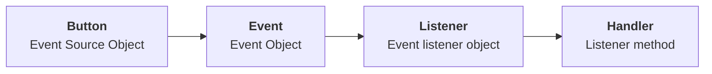
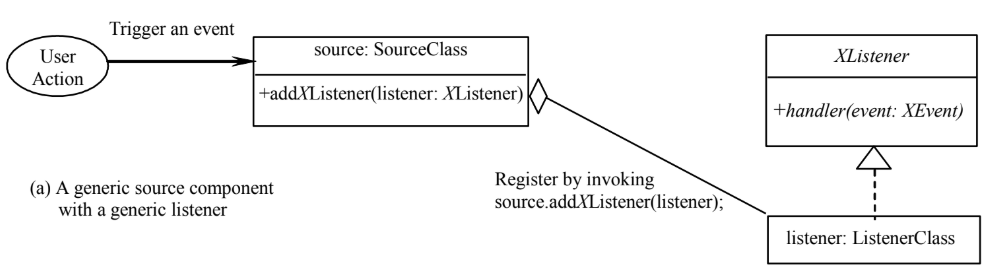

# C2 GUI: Event Handling

## Intro

- GUI are **event-driven**, requires user interaction, known as **event**.
- **Event handling:** Process to respond to events by **event handler**.

### Procedural vs Event-Driven Programming

| Procedural       | Difference | Event-Driven         |
| ---------------- | ---------- | -------------------- |
| Procedural order | Execution  | Activation of events |

## Events

- **Definition**: Signal to the program that something happened.
- Generated externally
- **Event Source Object:** The place the event is generated. In this case, referring to which GUI component.

### User Action, Source Object & Event Type Fired

- Different objects generate different event type

| User Action                          | Source Object  | Event Type Fired           |
| ------------------------------------ | -------------- | -------------------------- |
| Button click                         | `JButton`      | `ActionEvent`              |
| Radio button click                   | `JRadioButton` | `ItemEvent`, `ActionEvent` |
| Window interaction (open/close, etc) | `Window`       | `WindowEvent`              |
| Mouse action                         | `Component`    | `MouseEvent`               |

### Response to events

The basic flow is:



- Basically, clicking an ESO fires an action into the EO. The event passes this to an ELO. Upon receiving the message, the ELO (always active, lightweight) activates the LM (trigger, heavyweight).

### Delegation-based model

- Used by Java.
- Basically the listeners wait and spring into action when poked by a source object.

#### Steps

- Create listener object of corresponding listener interface

  - ```java
    class OKListenerClass implements ActionListener {
    	public void actionPerformed(ActionEvent e) {
    	}
    }
    ```

- Implement handler

  - ```java
    class OKListenerClass implements ActionListener {
    	public void actionPerformed(ActionEvent e) {
    		JOptionPane.showMessageDialog(null, "OK button clicked"); // this part
    	}
    }
    ```

- Register with source object

  - ```java
    private JButton jbtOK = new JButton("OK");
    jbtOK.addActionListener(new OKListenerClass()); // this part
    ```



### Requirements to be listener

- Must be **instance of event-listener interface**. Ensure has correct handler. TL;DR: Must `implements` something
- Must be registered to source object via `source.addActionListener(listener)`. TL;DR: Must be subscribed to source. Like how you subscribe to newspaper.

### Inner/Nested classes

- Classes declared inside other classes
- Strong relationship with outer class.
- Direct access to all variables of outer class.
- Can have visibility modifier
- Can be `static`, access using outer class name.
  - If `static`, cannot access non-static members of outer class

### Event Information

- `EventObject.getSource()`: Identify source object of event

### Event Listeners

- Usually named `XListener` for `XEvent`  where `X` is a random variable
- Registration (aka subscribing) methods: Usually named `addXListener`, like the point above.

### Anonymous Class Listeners

- Listener class specifically for listener object. 

- Defined inside frame as inner class

- Inner class without a name. Put the constructor, followed by methods inside the parenthesis.

- Conditions:

  - Must always `extend` or `implement` an interface implicitly.
  - Must implement all `abstract` methods.
  - Always use no-arg constructor to create instance.

- Example (P.S.: Comments are anime reference):

  ```java
  public HandleEvent() {
      jbtOk.addActionListener(
      	new ActionListener() {								// NOTICE
              public void actionPerformed(ActionEvent e) {	// ME,
                  System.out.println("OK button clicked");	// SENPAI!
              }												
          }													
      )
  }
  ```

### Multiple Listeners for a Source

- Source object can fire multiple events, kind of a "broadcaster"


