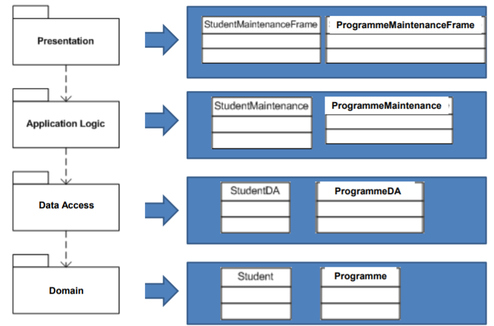

# GUI C5: Database Programming with JDBC

## Note: 

This note will be based on "Lesson Objectives", a test-run to see effectiveness.

## O1: Describe the concept of database and DBMS.

### JDBC API

- **JDBC**: Java Database Connectivity, provides uniform interface to access & manipulate relational databases.
- Features:
  - Execute SQL statements
  - Retrieve results
  - Output data in user friendly interface
  - Store changes in database
- JDBC drivers are database sprvigiv

## O2: Code for the 4 steps to connect & access JDBC

### Key Interfaces

- Driver
- Connection
- Statement
- `ResultSet`

They are framework for generic SQL database access. JDBC driver give implementation.

### Connecting & Accessing Database (Steps)

#### 1. Driver: Load Appropriate Driver

- Syntax: `Class.forName("<String - JDBCDriverClass");`
- For **Derby**: `"sun.jdbc.odbc.JdbcOdbcDriver"`

- **Note**: Remember to add JAR/ZIP class package to `classpath` for JVM to find.
- **Automatic Driver Discovery:** No need to load DB driver, but must include in `classpath`
  - Eg: `set classpath=%classpath%;c:\location\to\thenameofjdbcclassfile.jar`

#### 2. Connection: Connecting to DB

- Use `Connection` object
- Syntax: `Connection con = Drivermanger.getConnection("<DB URL string>");`
- URL for **Derby**: `jdbc:derby://localhost:1527/dbname`, replace `dbname`

#### 3a. Statement: Create SQL Statement Object

- `Statement` object: delivers SQL statement to DB, get result back
- Syntax: `Statememt sm = con.createStatement();`

#### 3b. Statement: Execute SQL statements

- For `INSERT`, `UPDATE`, `DELETE`: `executeUpdate(String sql)`
- For `SELECT`: `executeQuery(String sql)`
- Output: `ResultSet` object

#### 4. ResultSet: Process Result Set

- `ResultSet`: Table of results
  - Start position: `null`
  - Default:
    - Not updatable
    - Move forward only

| Methods                   | Description                                                  |
| ------------------------- | ------------------------------------------------------------ |
| `next()`                  | Move to next row. If no more row, return `false`.            |
| `getX(int columnIndex)`   | Returns value at specified `columnIndex` as `X` data type. Starts from **1**. |
| `getX(String columnName)` | Returns value with matching `columnName` as `X` data type, case insensitive, returns first matching. |

- Typical operation:

  ```java
  Statement stmt = conn.createStatement();
  // declare ResultSet object to store query result
  ResultSet rsStudent;
  // select all student records
  rsStudent = stmt.executeQuery (“SELECT * FROM Student”);
  
  // loop through the result set and display the student names
  while (rsStudent.next()){
   // display student’s details on the console
   System.out.println(“name:” + rsStudent.getString(3));
   System.out.println(“IC :” + rsStudent.getString(2));
  }
  ```

## O3: Use prepared statements to execute precompiled SQL statements. 

### `PreparedStatement`

- Extends `Statement`
- Allowing execution of *precompiled* SQL *with parameters*
- More efficient for repeated execution

- Create using `prepareStatement(String sql)` in `Connection` interface

- Example:

  ```java
  Statement stmt = conn.createStatement();
  PreparedStatement ps = conn.prepareStatement(
      "SELECT * FROM Programme WHERE Code = ?");
  Statement ps2 = conn.prepareStatement("INSERT INTO Programme VALUES(?, ?, ?)");
  // NOTE: Question marks are placeholders
  ```

### Setting Parameter Values in `PreparedStatement`

- General syntax: `setX(int parameterIndex, X value)`

- Example: `setString(1, jtfStudentID.getText());`

### Executing `PreparedStatement`

- SELECT: `ps.executeQuery()`
- UPDATE/INSERT/DELETE: `ps.executeUpdate()`


## O4: Process updateable and scrollable result sets.

### Note

- These are not fully stated in notes for some reason. Because I studied this in holidays, there are not much "reference" I could rely on. Therefore, I picked some easy-to-get online sources.
- Therefore, this part is OPTIONAL.

### Creation

- Syntax: 

  ```java
  Statement st = conn.createStatement(int resultSetType, int resultSetConcurrency);
  ```

  - `resultSetType` determine scrollability
    - `TYPE_FORWARD_ONLY` (default)
    - `TYPE_SCROLL_INSENSITIVE`: Scrollable, not sensitive to DB changes
    - `TYPE_SCROLL_SENSITIVE`: Scrollable, sensitive to DB changes
  - `resultSetConcurrency`: determine updatability
    - `CONCUR_READ_ONLY` (default)
    - `CONCUR_UPDATABLE`

### Manipulation

- Syntax:
  - Scrolling: 
    - `first()`, 
    - `next()`, 
    - `previous()`, 
    - `relative(int rows)` (positive: forward, negative: backwards)
    - `absolute(int x)`: move to `x` row number. (positive: count from start, negative: cout from end)

### Checking, `DatabaseMetaData`

- **Declaration**: `DatabaseMetaData metadata = conn.getMetaData();`
- **Checking:** 
  - `supportsResultSetType(int resultSetType)`
  - `supportsResultSetConcurrency(int resultSetType, int resultSetConcurrency)`
  - Note: all of the `CONCUR_READ_ONLY` and so on are actually integer-value constants.
  - They return `true` if supported, and vice versa

## 4-Layer/Tier Architecture

